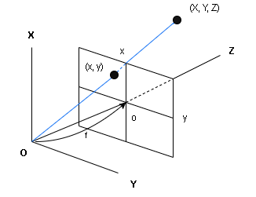

# 3D reconstruction from 2 images

## Camera model and self-calibration
To perform triangulation, the camera matrices $P$ and $P\prime$ of the two cameras must be known. Camera calibration for this purpose can be performed using a calibration board, but it is also possible to directly determine $P$,$P\prime$ by calculating the fundamental matrix $F$ between the two images taken. This determination of the camera matrix directly from the captured images without prior calibration is called **self-calibration**.  
First of all, the camera coordinate system of the first camera is considered to be the world coordinate system. That is, the viewpoint $O_c$ of the first camera is taken as the origin of the world coordinate system, and the $X_cY_cZ_c$ coordinate system is aligned with the $XYZ$ world coordinate system. Next, the optical axis point is assumed to be known (the center of the image plane for most cameras). Then, take the $xy$ coordinate system with the optical axis point as the origin $o$. Furthermore, assume that there is no distortion in the image, the $x$-axis and $y$-axis are parallel to the $X$-axis and $Y$-axis, and the image plane is orthogonal to the optical axis (=$Z$-axis).

When taking the $xy$ coordinate system on an image, it is natural to consider that the optical axis ($Z$-axis) direction extends beyond the image. The position (x,y) on the image where a point (X,Y,Z) in the scene is projected is as follows.

$$
x=f\frac{X}{Z}, y=f\frac{Y}{Z} \tag{1}
$$

$f$ is the distance between the image plane and the $XY$ plane and is called the focal length. Eq(1) can be rewritten as

$$
\begin{pmatrix}
x/f_0 \\
y/f_0 \\
1 \\
\end{pmatrix}\simeq
\begin{pmatrix}
f & 0 & 0 \\
0 & f & 0 \\
0 & 0 & f_0 \\
\end{pmatrix}
\begin{pmatrix}
X \\
Y \\
Z \\
\end{pmatrix} \tag{2}
$$

The same is true for the second camera, since it can be considered in the same way,

$$
\begin{pmatrix}
x\prime/f_0 \\
y\prime/f_0 \\
1 \\
\end{pmatrix}\simeq
\begin{pmatrix}
f\prime & 0 & 0 \\
0 & f\prime & 0 \\
0 & 0 & f_0 \\
\end{pmatrix}
\begin{pmatrix}
X_c\prime \\
Y_c\prime \\
Z_c\prime \\
\end{pmatrix} \tag{3}
$$

$f\prime$ is the focal length of the second camera. However, since the $X_c\prime Y_c\prime Z_c\prime$ coordinate system is rotated by the rotation matrix $R$ and translated $t$ relative to the $XYZ$ world coordinate system (coordinate system of the first camera), the position of point $(X_c\prime Y_c\prime Z_c\prime)$ relative to the $XYZ$ world coordinate system is as follows.

$$
\begin{pmatrix}
X \\
Y \\
Z \\
\end{pmatrix}=
R\begin{pmatrix}
X_c\prime \\
Y_c\prime \\
Z_c\prime \\
\end{pmatrix} + t \tag{4}
$$

Combined with equation (3), we can write

$$
\begin{pmatrix}
x\prime/f_0 \\
y\prime/f_0 \\
1 \\
\end{pmatrix}\simeq
\begin{pmatrix}
f\prime & 0 & 0 \\
0 & f\prime & 0 \\
0 & 0 & f_0 \\
\end{pmatrix}R^\intercal
\begin{pmatrix}
\begin{pmatrix}
X \\
Y \\
Z \\
\end{pmatrix}-t
\end{pmatrix}
=\begin{pmatrix}
f\prime & 0 & 0 \\
0 & f\prime & 0 \\
0 & 0 & f_0 \\
\end{pmatrix}
\begin{pmatrix}
R^\intercal & -R^\intercal t
\end{pmatrix}
\begin{pmatrix}
X \\
Y \\
Z \\
1 \\
\end{pmatrix}
\tag{5}
$$

If you correspond as follows,

$$
\begin{pmatrix}
x/f_0 \\
y/f_0 \\
1 \\
\end{pmatrix}\simeq P
\begin{pmatrix}
X \\
Y \\
Z \\
1 \\
\end{pmatrix},
\begin{pmatrix}
x\prime/f_0 \\
y\prime/f_0 \\
1 \\
\end{pmatrix}\simeq P\prime
\begin{pmatrix}
X \\
Y \\
Z \\
1 \\
\end{pmatrix} \tag{6}
$$

The camera matrices $P,P\prime$ can be written as

$$
P=\begin{pmatrix}
f & 0 & 0 \\
0 & f & 0 \\
0 & 0 & f_0 \\
\end{pmatrix}
\begin{pmatrix}
I & 0
\end{pmatrix},
P\prime=\begin{pmatrix}
f\prime & 0 & 0 \\
0 & f\prime & 0 \\
0 & 0 & f_0 \\
\end{pmatrix}
\begin{pmatrix}
R^\intercal & -R^\intercal t
\end{pmatrix} \tag{7}
$$

Therefore, to determine the camera matrices $P, P\prime$ from the two images, $f, f\prime, R, t$ can be determined. However, since there is no depth information in the images, the magnitude of the translation $t$ cannot be determined in principle. Therefore, we assume that $\lVert t \rVert =1$. In other words, a constant-fold indefiniteness remains for 3D reconstruction from 2 images.

  

## The representation of fundamental matrix
Since the two lines of sight intersect, the vector pointing to point $(x,y)$ on the image plane from the viewpoint of the first camera, the point $(x\prime,y\prime)$ on the image plane from the viewpoint of the second camera, and the viewpoint shift t are on the same plane, the following formula holds.

$$
\begin{pmatrix}
\begin{pmatrix}
x \\
y \\
f \\
\end{pmatrix},
t\times R
\begin{pmatrix}
x\prime \\
y\prime \\
f\prime \\
\end{pmatrix}
\end{pmatrix}=0 \tag{8}
$$

$\times$ means the outer product.

Here, we introduce a new notation. For a vector $a=(a_i)$, we define the matrix $a\times$ as follows. For more information on notation, see [here](https://w3e.kanazawa-it.ac.jp/math/physics/category/physical_math/linear_algebra/henkan-tex.cgi?target=/math/physics/category/physical_math/linear_algebra/vector_product_matrix.html).

$$
a\times=
\begin{pmatrix}
0 & -a_3 & a_2 \\
a_3 & 0 & -a_1 \\
-a_2 & a_1 & 0 \\
\end{pmatrix} \tag{9}
$$

Using this notation, Eq(8) can be rewritten as

$$
\begin{pmatrix}
\begin{pmatrix}
f_0 & 0 & 0 \\
0 & f_0 & 0 \\
0 & 0 & f \\
\end{pmatrix}
\begin{pmatrix}
x/f_0 \\
y/f_0 \\
1 \\
\end{pmatrix},
\begin{pmatrix}
t\times R
\end{pmatrix}
\begin{pmatrix}
f_0 & 0 & 0 \\
0 & f_0 & 0 \\
0 & 0 & f\prime \\
\end{pmatrix}
\begin{pmatrix}
x\prime/f_0 \\
y\prime/f_0 \\
1 \\
\end{pmatrix}
\end{pmatrix} \\
=
\begin{pmatrix}
\begin{pmatrix}
x/f_0 \\
y/f_0 \\
1 \\
\end{pmatrix},
\begin{pmatrix}
f_0 & 0 & 0 \\
0 & f_0 & 0 \\
0 & 0 & f \\
\end{pmatrix}
\begin{pmatrix}
t\times R
\end{pmatrix}
\begin{pmatrix}
f_0 & 0 & 0 \\
0 & f_0 & 0 \\
0 & 0 & f\prime \\
\end{pmatrix}
\begin{pmatrix}
x\prime/f_0 \\
y\prime/f_0 \\
1 \\
\end{pmatrix}
\end{pmatrix} \tag{10}
$$

From the epipolar equation, since the following holds

$$
\begin{pmatrix}
\begin{pmatrix}
x/f_0 \\
y/f_0 \\
1 \\
\end{pmatrix},
F
\begin{pmatrix}
x\prime/f_0 \\
y\prime/f_0 \\
1 \\
\end{pmatrix}
\end{pmatrix}=0 \tag{11}
$$

Comparing Eq(10) and (11), the basis matrix $F$ is expressed as

$$
F\simeq
\begin{pmatrix}
f_0 & 0 & 0 \\
0 & f_0 & 0 \\
0 & 0 & f \\
\end{pmatrix}
\begin{pmatrix}
t\times R
\end{pmatrix}
\begin{pmatrix}
f_0 & 0 & 0 \\
0 & f_0 & 0 \\
0 & 0 & f\prime \\
\end{pmatrix} \tag{12}
$$

From the above, the self-calibration of the camera matrices $P$ and $P\prime$ is attributed to the calculation of $f, f\prime, t, R$ satisfying Eq(12) from the given basis matrix $F$.

  

## Reference
- [3D Computer Vision Computation Handbook](https://www.morikita.co.jp/books/mid/081791)
- [Representation matrix for vector product](https://w3e.kanazawa-it.ac.jp/math/physics/category/physical_math/linear_algebra/henkan-tex.cgi?target=/math/physics/category/physical_math/linear_algebra/vector_product_matrix.html)