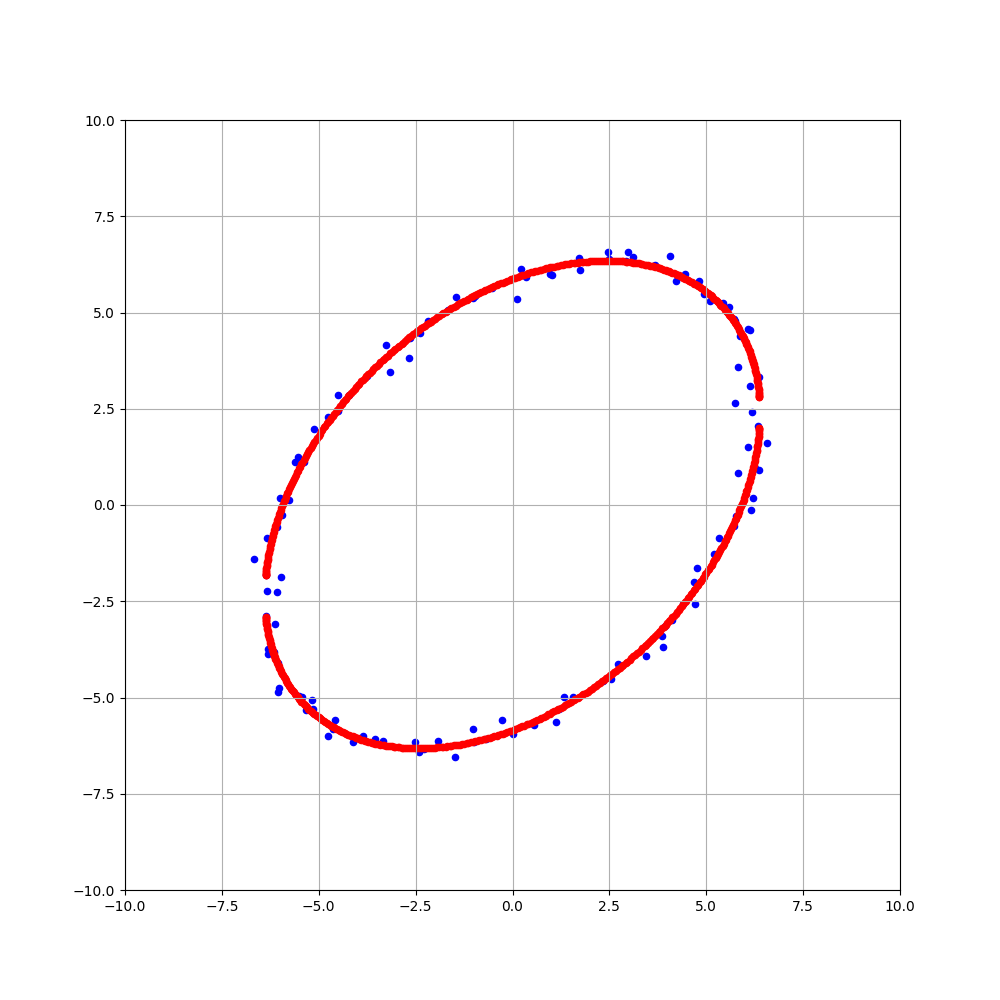

# 3D computer vision
This repository is an experiment in understanding and experimenting with 3D computer vision.  
Let's enjoy 3D computer vision.

  

## [Elliptic fitting](https://github.com/Hiroaki-K4/3d_computer_vision/tree/main/elliptic_fitting)

