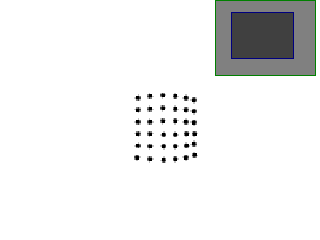
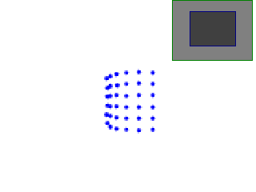
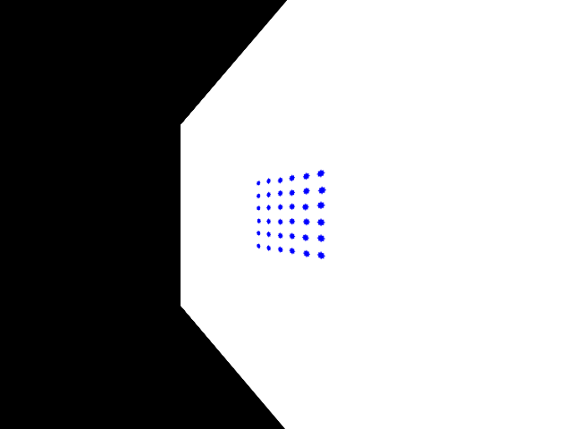
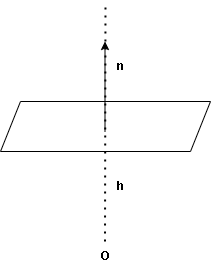

# 3D Computer Vision
This repository is an experiment in understanding and experimenting with 3D computer vision.  
Let's enjoy 3D computer vision.

  

## [Elliptic Fitting](https://github.com/Hiroaki-K4/3d_computer_vision/tree/main/elliptic_fitting)

  

## [Fundamental matrix](https://github.com/Hiroaki-K4/3d_computer_vision/tree/main/fundamental_matrix)

  

## [Equirectangular to Cubemap](https://github.com/Hiroaki-K4/3d_computer_vision/tree/main/equirectangular_to_cubemap)

  

## [Equirectangular to Sphere](https://github.com/Hiroaki-K4/3d_computer_vision/tree/main/equirectangular_to_sphere)

  

## [Triangulation](https://github.com/Hiroaki-K4/3d_computer_vision/tree/main/triangulation)

  

## [Projective Transformation](https://github.com/Hiroaki-K4/3d_computer_vision/tree/main/projective_transformation)

  

## [Homography decompostion](https://github.com/Hiroaki-K4/3d_computer_vision/tree/main/homography_decomposition)

  

## [Elliptic analysis](https://github.com/Hiroaki-K4/3d_computer_vision/tree/main/elliptic_analysis)

