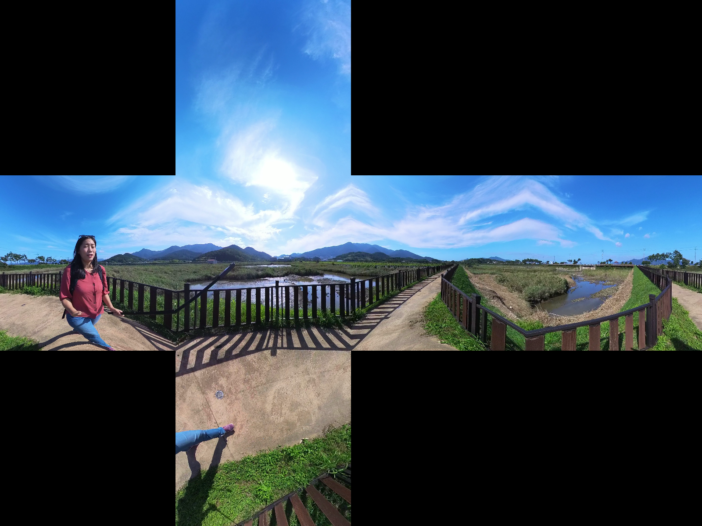

# 3D computer vision
This repository is an experiment in understanding and experimenting with 3D computer vision.  
Let's enjoy 3D computer vision.

  

## [Elliptic fitting](https://github.com/Hiroaki-K4/3d_computer_vision/tree/main/elliptic_fitting)

  

## [Fundamental matrix](https://github.com/Hiroaki-K4/3d_computer_vision/tree/main/fundamental_matrix)

  

## [Equirectangular to cubemap](https://github.com/Hiroaki-K4/3d_computer_vision/tree/main/equirectangular_to_cubemap)

  

## [Equirectangular to sphere](https://github.com/Hiroaki-K4/3d_computer_vision/tree/main/equirectangular_to_sphere)

  

## [Triangulation](https://github.com/Hiroaki-K4/3d_computer_vision/tree/main/triangulation)

  

## [3D reconstruction from 2 images](https://github.com/Hiroaki-K4/3d_computer_vision/tree/main/3d_reconstruction_from_2_images)
