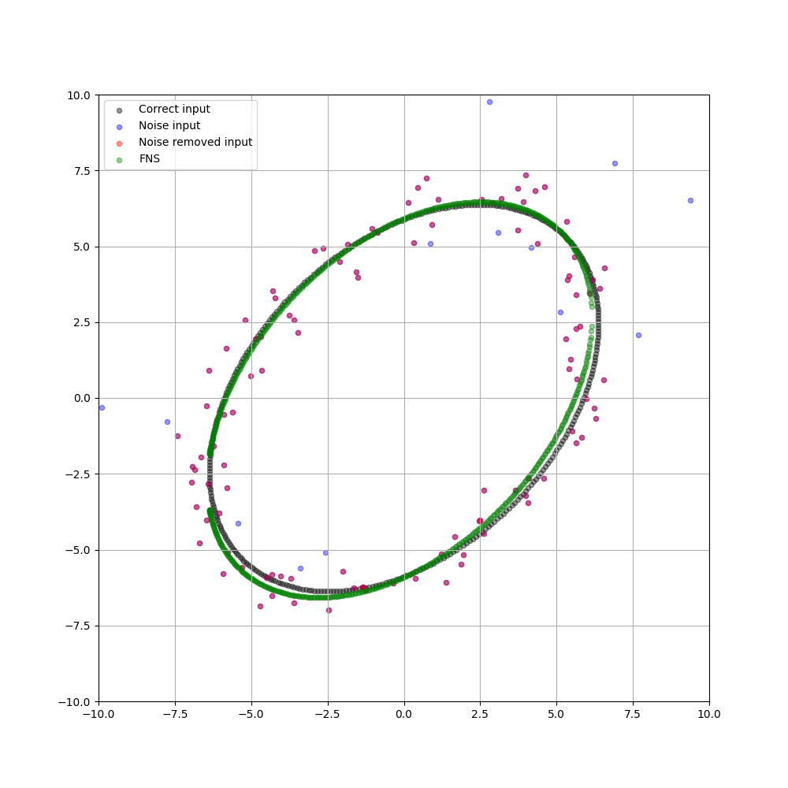
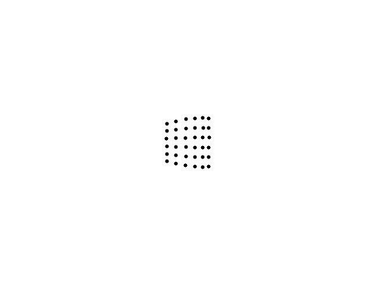

# 3D Computer Vision
This repository is an experiment in understanding and experimenting with 3D computer vision.  
Let's enjoy 3D computer vision.

## Related articles I wrote
- [Implementing Self-Calibration for Perspective Camera](https://medium.com/@hirok4/implementing-self-calibration-for-perspective-camera-6f624be04e0f)
- [Convert Equirectangular Image to Cubemap Image](https://medium.com/@hirok4/convert-equirectangular-image-to-cubemap-image-b8f015be0744)
- [Python Implementation of Ellipse Fitting](https://medium.com/@hirok4/python-implementation-of-ellipse-fitting-e8801dbb16a8)
- [Algorithm to Decompose Camera Matrix](https://medium.com/@hirok4/algorithm-to-decompose-camera-matrix-c3f6ebb98aef)
- [Euclidean Upgrading in Self-Calibration for Perspective Camera](https://medium.com/@hirok4/euclidean-upgrading-in-self-calibration-for-perspective-camera-3e88c0e1ed78)
- [Calculate the Intersection of Ellipses](https://medium.com/@hirok4/calculate-the-intersection-of-ellipses-7650394a6664)
- [Implementation of 3D Reconstruction of a Plane Surface](https://medium.com/@hirok4/implementation-of-3d-reconstruction-of-a-plane-surface-5048f0ee9f92)
- [Implementation of Planar Triangulation](https://medium.com/@hirok4/implementation-of-planar-triangulation-c66ef654c7fa)
- [Implementation of Projective Transformation](https://medium.com/@hirok4/implementation-of-projective-transformation-454ad68fc0dd)
- [Python Implementation of Triangulation](https://medium.com/@hirok4/python-implementation-of-triangulation-88f377de3cd1)
- [Python Implementation of the Fundamental Matrix Calculation](https://medium.com/@hirok4/python-implementation-of-the-fundamental-matrix-calculation-4cfb8d48ad4)
- [Converting the Coordinates on the Equirectangular Image to 3D Coordinates on a Sphere](https://medium.com/@hirok4/converting-the-coordinates-on-the-equirectangular-image-to-3d-coordinates-on-a-sphere-ba39a896bc9a)

  

# Projects
## [Elliptic Fitting](https://github.com/Hiroaki-K4/3d_computer_vision/tree/main/elliptic_fitting)

  

## [Fundamental Matrix](https://github.com/Hiroaki-K4/3d_computer_vision/tree/main/fundamental_matrix)

  

## [Equirectangular to Cubemap](https://github.com/Hiroaki-K4/3d_computer_vision/tree/main/equirectangular_to_cubemap)

  

## [Equirectangular to Sphere](https://github.com/Hiroaki-K4/3d_computer_vision/tree/main/equirectangular_to_sphere)

  

## [Triangulation](https://github.com/Hiroaki-K4/3d_computer_vision/tree/main/triangulation)

  

## [Projective Transformation](https://github.com/Hiroaki-K4/3d_computer_vision/tree/main/projective_transformation)

  

## [Homography decompostion](https://github.com/Hiroaki-K4/3d_computer_vision/tree/main/homography_decomposition)

  

## [Elliptic analysis](https://github.com/Hiroaki-K4/3d_computer_vision/tree/main/elliptic_analysis)

