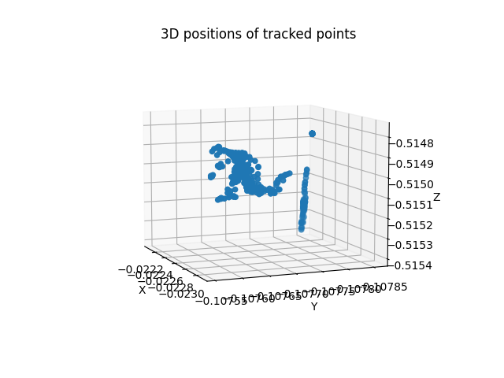
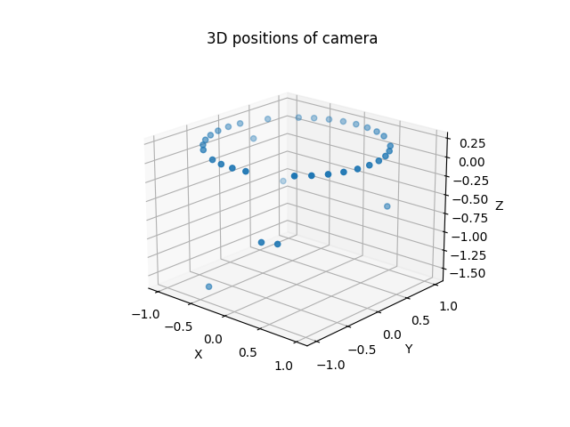
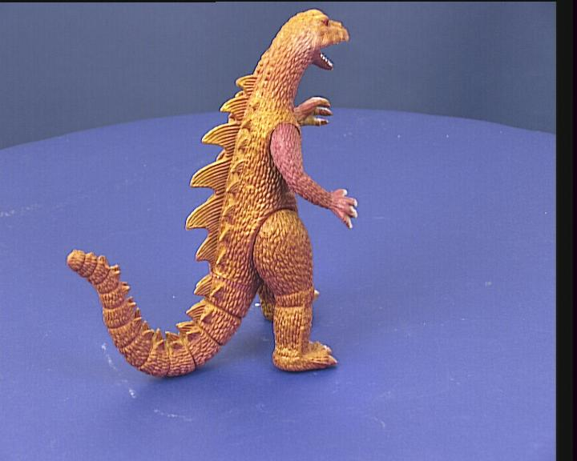

# Bundle adjustment
Bundle adjustment is a technique that calculates the 3D shapes of the scene, positions of each camera and the intrinsic parameters simultaneously to satisfy the perspective projection model of camera by using images taken with multiple cameras of a 3D scene. We fix one world coordinates and let the position of $k$-th camera $(k=1,...,M)$ be $t_k$. And, we suppose that the coordinates of each camera is rotated by $R_k$ with respect to the world coordinates and let the focal length be $f_k$ and the optical axis point be $(u_{0k},v_{0k})$.  
We define the projection positionof $\alpha$-th point $(X_\alpha, Y_\alpha, Z_\alpha)$ on $k$-th image as $(x_{\alpha k}, y_{\alpha k})$. The relationship of the perspective projection is as follows.

$$
\begin{pmatrix}
x_{\alpha k}/f_0 \\
y_{\alpha k}/f_0 \\
1 \\
\end{pmatrix}\simeq
P_k
\begin{pmatrix}
X_\alpha \\
Y_\alpha \\
Z_\alpha \\
1 \\
\end{pmatrix} \tag{1}
$$

The camera matrix $P_k$ of $k$-th camera has following form.

$$
P_k=
\begin{pmatrix}
f_k & 0 & u_{0k} \\
0 & f_k & v_{0k} \\
0 & 0 & f_0 \\
\end{pmatrix}
\begin{pmatrix}
R_k^\intercal & -R_k^\intercal t_k \\
\end{pmatrix} \tag{2}
$$

Here, it is assumed that the optical axis point is shifted from the origin by $(u_{0k},v_{0k})$. Eq(2) can also be written as follows.

$$
P_k=K_kR_k^\intercal
\begin{pmatrix}
I & -t_k
\end{pmatrix}, \quad
K_k\equiv
\begin{pmatrix}
f_k & 0 & u_{0k} \\
0 & f_k & v_{0k} \\
0 & 0 & f_0 \\
\end{pmatrix} \tag{3}
$$

$K_k$ is called as the intrinsic parameter matrix of $k$-th camera. The following equation is obtained by solving Eq(1) for $x_{\alpha k}, y_{\alpha k}$.

$$
x_{\alpha k}=f_0 \frac{P_{k(11)}X_\alpha + P_{k(12)}Y_\alpha + P_{k(13)}Z_\alpha + P_{k(14)}}{P_{k(31)}X_\alpha + P_{k(32)}Y_\alpha + P_{k(33)}Z_\alpha + P_{k(34)}} \\
x_{\alpha k}=f_0 \frac{P_{k(21)}X_\alpha + P_{k(22)}Y_\alpha + P_{k(23)}Z_\alpha + P_{k(24)}}{P_{k(31)}X_\alpha + P_{k(32)}Y_\alpha + P_{k(33)}Z_\alpha + P_{k(34)}} \tag{4}
$$

We write $(i,j)$ element of $P_k$ as $P_{k(ij)}$. The principle of bundle adjustment is that determine 3D position $(X_\alpha, Y_\alpha, Z_\alpha)$ and camera matrix $P_k$ minimize the following equation from observed points $(x_{\alpha k},y_{\alpha k}) (\alpha=1,...,N,k=1,...,M)$.

$$
E=\sum_{\alpha=1}^N \sum_{k=1}^M I_{\alpha k} \Bigl( \Bigl( \frac{x_{\alpha k}}{f_0} - \frac{P_{k(11)}X_\alpha + P_{k(12)}Y_\alpha + P_{k(13)}Z_\alpha + P_{k(14)}}{P_{k(31)}X_\alpha + P_{k(32)}Y_\alpha + P_{k(33)}Z_\alpha + P_{k(34)}} \Bigr)^2 \\
+ \Bigl( \frac{y_{\alpha k}}{f_0} - \frac{P_{k(21)}X_\alpha + P_{k(22)}Y_\alpha + P_{k(23)}Z_\alpha + P_{k(24)}}{P_{k(31)}X_\alpha + P_{k(32)}Y_\alpha + P_{k(33)}Z_\alpha + P_{k(34)}} \Bigr)^2 \Bigr) \tag{5}
$$

$I_{\alpha k}$ is the visibility index, it is 1 when $\alpha$-th point appears in $k$-th camera, and 0 otherwise. Eq(5) is the sum of squares of the differences between the position determined by perspective projection and actual observed position. It si called the **reprojection error**.

<br></br>

# Algorithm of bundle adjustment
We iterate for minimizing the reprojection error $E$ of Eq(5). That is, we give initial values to all unknown values and update them so that $E$  decrease with each iteration. Unknown values are each 3D position $X_\alpha=(X_\alpha, Y_\alpha, Z_\alpha)^\intercal$ and focal length $f_k$, optical axis points $(u_{0k}, v_{0k})$, translation $t_k$ and rotation $R_k(k=1,...,M)$ of each camera. The problem is updating rotation $R_k$. To deal with this, we calculate the transformation of $E$ by slightly rotating the camera by $\triangle w_k=(\triangle w_{k1}, \triangle w_{k2}, \triangle w_{k3})^\intercal$ around each axis. we represent the rate of change of $E$ for each as $\partial E / \partial w_{k1}, \partial E / \partial w_{k2}, \partial E / \partial w_{k3}$. There are $3N+9M$ update amounts: $\triangle X_\alpha, \triangle f_k, (\triangle u_{0k}, \triangle v_{0k}), \triangle t_k, \triangle w_k(\alpha=1,...,N,k=1,...,M)$. However it is not possible to determine all of these. Because positions of cameras and 3D shapes are relative and we can't determine absolute positions. Thus, we can't also define the absolute scale. Because images don't have depth information, we don't know we whether the camera was moved significantly to capture a faraway scene, or if the camera was moved slightly to capture a nearby scene. Therefore, we normalize as follows.

$$
R_1=I, \quad t_1=0, \quad t_{22}=1 \tag{6}
$$

This means that we use the world coordinates based on first camera. About scale, we define the translation in the y-axis direction of second camera for first camera as $1$. If we normalize as Eq(6), unknown quantities are reduced by $7$ to $3M+9N-7$.  
We add serial numbers to $3M+9N-7$ of unknown quantities $\triangle X_\alpha, \triangle f_k, (\triangle u_{0k}, \triangle v_{0k}), \triangle t_k, \triangle w_k$ and write as $\triangle \xi_1, \triangle \xi_2, ..., \triangle \xi_{3N+9M-7}$. And we use Levenberg Marquardt method for minimization. The whole method is as follows.

## Alogorithm
### 1. Set initial values of $X_\alpha, f_k, (u_{0k}, v_{0k}), t_k, R_k$ and calculate the reprojection error $E$. Then, we define $c$ as $0.0001$.

### 2. Calculate 1st and 2nd order differential $\partial E/\partial \xi_k, \partial^2 E/\partial \xi_k \partial \xi_l(k,l=1,...,3N+9M-7)$.

### 3. Calculate $\triangle xi_k(k=1,...,3N+9M-7)$ by solving following simultaneous linear equations.

$$
\begin{pmatrix}
(1+c)\partial^2 E/\partial \xi_1^2 & \partial^2 E/\partial \xi_1\xi_2 & \partial^2 E/\partial \xi_1\xi_3 & ... \\
\partial^2 E/\partial \xi_2\xi_1 & (1+c)\partial^2 E/\partial \xi_2^2 & \partial^2 E/\partial \xi_2\xi_3 & ... \\
\partial^2 E/\partial \xi_3\xi_1 & \partial^2 E/\partial \xi_3\xi_2 & (1+c)\partial^2 E/\partial \xi_3^2 & ... \\
... & ... & ... & ...
\end{pmatrix}
\begin{pmatrix}
\triangle \xi_1 \\
\triangle \xi_2 \\
\triangle \xi_3 \\
... \\
\end{pmatrix} \\
=-\begin{pmatrix}
\partial E/\partial \xi_1 \\
\partial E/\partial \xi_2 \\
\partial E/\partial \xi_3 \\
... \\
\end{pmatrix} \tag{7}
$$

### 4. Update $X_\alpha, f_k, (u_{0k}, v_{0k}), t_k, R_k$ as follows.

$$
\tilde{X_\alpha} \leftarrow X_\alpha+\triangle X_\alpha, \quad \tilde{f_k} \leftarrow f_k + \triangle f_k, \\
(\tilde{u_{0k}}, \tilde{v_{0k}})\leftarrow (u_{0k}+\triangle u_{0k}, v_{0k}+\triangle v_{0k}) \\
\tilde{t_k} \leftarrow t_k + \triangle t_k, \quad \tilde{R_k} \leftarrow R(\triangle w_k) R_k \tag{8}
$$

$R(\triangle w_k)$ is a rotation matrix of rotation angle $|\triangle w_k|$ around rotatino axis $\triangle w_k$.

### 5. Calculate the reprojection error $\tilde{E}$ for $\tilde{X_\alpha}, \tilde{f_k}, (\tilde{u_{0k}}, \tilde{v_{0k}}), \tilde{t_k}, \tilde{R_k}$. If $\tilde{E} > E$, set $c\leftarrow 10c$ and return step 3.

### 6. Update unknown values as follows, if $|\tilde{E}-E|\leq\delta$, terminate. Otherwise, update $E$ and $c$ as $E\leftarrow \tilde{E},c\leftarrow c/10$ and return step 2.

$$
X_\alpha \leftarrow \tilde{X_\alpha}, \quad f_k \leftarrow \tilde{f_k}, \quad (u_{0k},v_{0k}) \leftarrow (\tilde{u_{0k}},\tilde{v_{0k}}), \quad t_k \leftarrow \tilde{t_k}, \quad R_k \leftarrow \tilde{R_k} \tag{9}
$$

### Explanation
It is assumed that the initial value of step 1 is the solution follows normalization of Eq(6). In case that we use initial values $X_\alpha, t_k, R_k$ without considerating this, we rotate the world coordinates as $R_1$ is $I$, translate so that $t_1$ is at the origin and arrange the scale of $X_\alpha$ and $t_k$ as $t_{22}=1$. Specifically, we convert $X_\alpha, t_k, R_k$ as following $X_\alpha',t_k',R_k'$.

$$
X_\alpha'=\frac{1}{s}R_1^\intercal (X_\alpha-t1), \quad R_k'=R_1^\intercal R_k, \quad t_k'=\frac{1}{s}R_1^\intercal(t_k-t_1) \tag{10}
$$

We define $s$ and $j$ as $s=(j,R_1^\intercal(t_2-t_1)), j=(0,1,0)^\intercal$.  
The purpose of bundle adjustment is to find the solution minimizing reprojection errror, so it is practical to stop iteration when reprojection error stops changing. For exmaple, if it ends when amount of change in reprojection error per point becomes less than or equal to $\epsilon$, then infinitesimal constant $\delta$ becomes $\delta=n\epsilon^2/f_0^2$. We define $n$ as $n=\sum_{\alpha=1}^N \sum_{k=1}^M I_{\alpha k}$ (number of visible points on the image). In practical terms, it is sufficient to reduce $\epsilon$ to $\epsilon=0.01$.

<br></br>

# Calculating the derivative
To perform Levenberg Marquardt method, we need 1st and 2nd order derivatives for each variable of reprojection error of Eq(5). We show the principle of calculation and specific calculate method.

## Gauss-Newton approximation
We define $p_{\alpha k}, q_{\alpha k}, r_{\alpha k}$ as follows.

$$
p_{\alpha k}=P_{k(11)}X_\alpha + P_{k(12)}Y_\alpha + P_{k(13)}Z_\alpha + P_{k(14)} \\
q_{\alpha k}=P_{k(21)}X_\alpha + P_{k(22)}Y_\alpha + P_{k(23)}Z_\alpha + P_{k(24)} \\
r_{\alpha k}=P_{k(31)}X_\alpha + P_{k(32)}Y_\alpha + P_{k(33)}Z_\alpha + P_{k(34)} \tag{11}
$$

We rewrite Eq(5) as follows.

$$
E=\sum_{\alpha=1}^N \sum_{k=1}^M I_{\alpha k} \Bigl( \Bigl( \frac{p_{\alpha k}}{r_{\alpha k}} - \frac{x_{\alpha k}}{f_0} \Bigr)^2 + \Bigl( \frac{q_{\alpha k}}{r_{\alpha k}} - \frac{y_{\alpha k}}{f_0} \Bigr)^2 \Bigr) \tag{12}
$$

This differential can be written as follows.

$$
\frac{\partial E}{\partial \xi_k}=2\sum_{\alpha=1}^N \sum_{k=1}^M \frac{I_{\alpha k}}{r^2_{\alpha k}} \Bigl( \Bigl( \frac{p_{\alpha k}}{r_{\alpha k}}-\frac{x_{\alpha k}}{f_0} \Bigr) \Bigl( r_{\alpha k}\frac{\partial p_{\alpha k}}{\partial \xi_k} - p_{\alpha k}\frac{\partial r_{\alpha k}}{\partial \xi_k} \Bigr) + \Bigl( \frac{q_{\alpha k}}{r_{\alpha k}}-\frac{y_{\alpha k}}{f_0} \Bigr) \Bigl( r_{\alpha k}\frac{\partial q_{\alpha k}}{\partial \xi_k} - q_{\alpha k}\frac{\partial r_{\alpha k}}{\partial \xi_k} \Bigr) \Bigr) \tag{13}
$$

<br></br>

# Experiments
## Prepare dataset
We need to prepare the dataset for bundle adjustment by following steps. We use the [Oxford dinosaur dataset](https://www.robots.ox.ac.uk/~vgg/data/mview/).

### 1. Convert ppm images to jpg images.

```bash
python3 convert_ppm_to_jpg.py
```

### 2. Read camera matrix from matlab file and save it to json file.

```bash
python3 read_matlab_file.py
```

### 3. Disassemble camera to matrix to get camera intrinsic parameter, rotation matrix and translation matrix.

```bash
python3 disassemble_camera_matrix.py
```

### 4. Calculate initial 3D position of points by triangulation.

```bash
python3 calculate_3d_points_by_triangulation.py
```



<br></br>

## Appendix: Camera matrix decomposition
We can calculate camera intrinsic parameter $K$, rotation $R$ and translation $t$ when $3\times 4$ camera matrix $P$ is given. The method is as follows.

### 1. Define $P_k$ as $P_k=\begin{pmatrix}Q & q\end{pmatrix}$. That is, define first $3\times 3$ part of $P_k$ as $Q$ and 4th column as $q$.

### 2. If $detQ < 0$, change sign of $Q$ and $q$.

### 3. Define translation $t_k$ as follows.

$$
t_k=-Q^{-1}q
$$

### 4. Perform the Cholesky decomposition of $(QQ)^{-1}$ as follows. $C$ is the upper triangular matrix.

$$
(QQ)^{-1}=C^\intercal C
$$

### 5. Define $K_k$ as follows.

$$
K_k=C^{-1}
$$

### 6. Define rotation $R_k$ as follows.

$$
R_k = Q^\intercal C^\intercal
$$

### Explanation
We want to calculate the upper triangular matrix $K_k$, the rotation matrix $R_k$ and the translation vector $t_k$ satisfy following equation.

$$
Q=K_kR_K^\intercal, \quad q=K_kR_K^\intercal t_k
$$

First, $t_k$ is determined as step3 by $q=-Qt_k$. From $R_k^\intercal R_k=I$, we get following relationship.

$$
QQ^\intercal=K_kK_k^\intercal
$$

This inverse matrix is as follows.

$$
(QQ^\intercal)^{-1}=(K_k^-)^\intercal K_k^{-1}
$$

Perform the Cholesky decomposition of $(QQ^\intercal)^{-1}$ and represents as step4 by the upper triangular matrix $C$, we can get $K_k$. And, we can represent $Q$ as follows.

$$
Q=C^{-1}R^\intercal
$$

Transposing both sides, we get $Q^\intercal=R_k(C^\intercal)^{-1}$ and find $R_k$ as step6. $R_k$ calculated like this is the rotation matrix.

$$
R_kR_k^\intercal=Q^\intercal C^\intercal CQ=Q^\intercal(QQ^\intercal)^{-1}Q=Q^\intercal(Q^\intercal)^{-1}Q^{-1}Q=I
$$

$R_k$ satisfies $detR_k > 0$. Because $detR_k$ satisfies $detR_K=detQ^\intercal detC^\intercal=detQdetC$. By adjusting the sign, $detQ>0$ holds true. And $detC>0$ holds true because the signs of the diagonal elements are chosen to be positive in the Cholesky decomposition.

You can get camera intrinsic parameter $K$, rotation $R$ and translation $t$ by running below command. 3D positions obtained by decomposing camera parameters from the [Oxford dinosaur dataset](https://www.robots.ox.ac.uk/~vgg/data/mview/) are drawn as the below image.

```bash
python3 disassemble_camera_matrix.py
```



The Oxford dinosaur dataset is as follows.



<br></br>

# References
- [3D Computer Vision Computation Handbook](https://www.morikita.co.jp/books/mid/081791)
- [Multi-view Data](https://www.robots.ox.ac.uk/~vgg/data/mview/)
