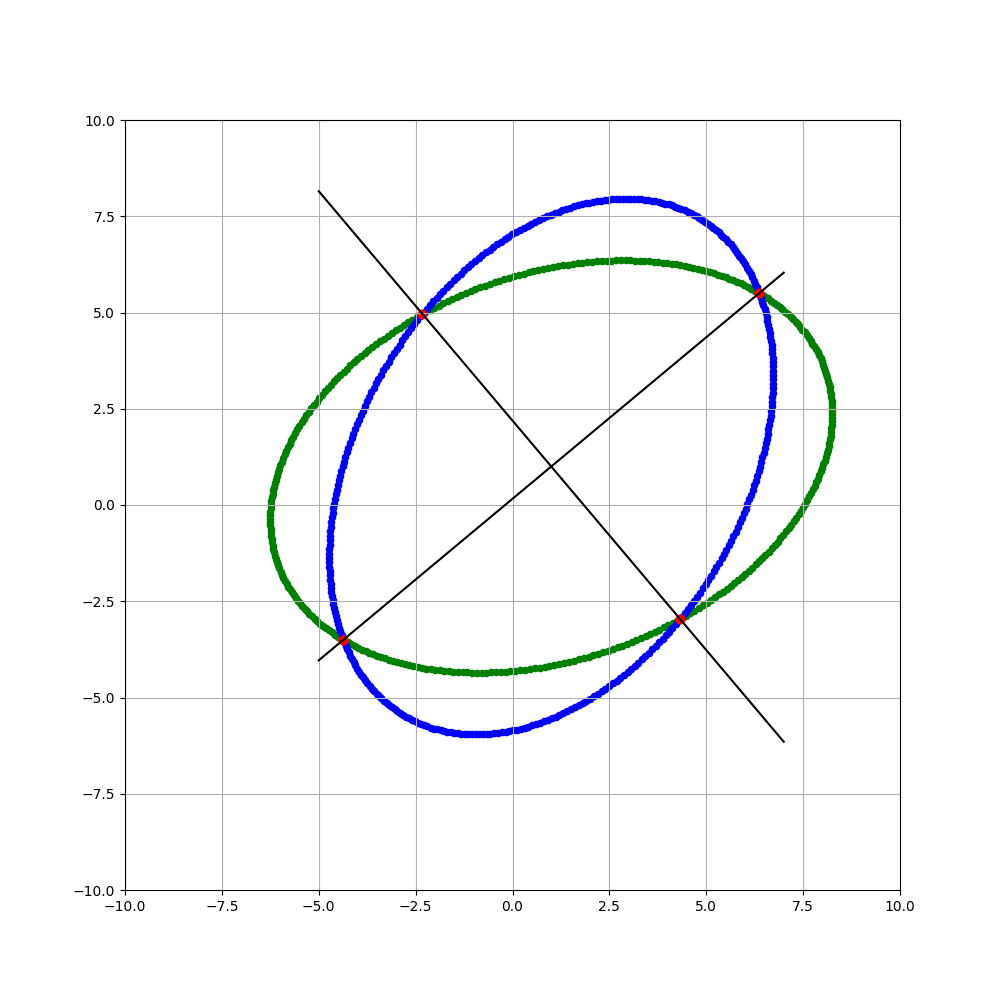
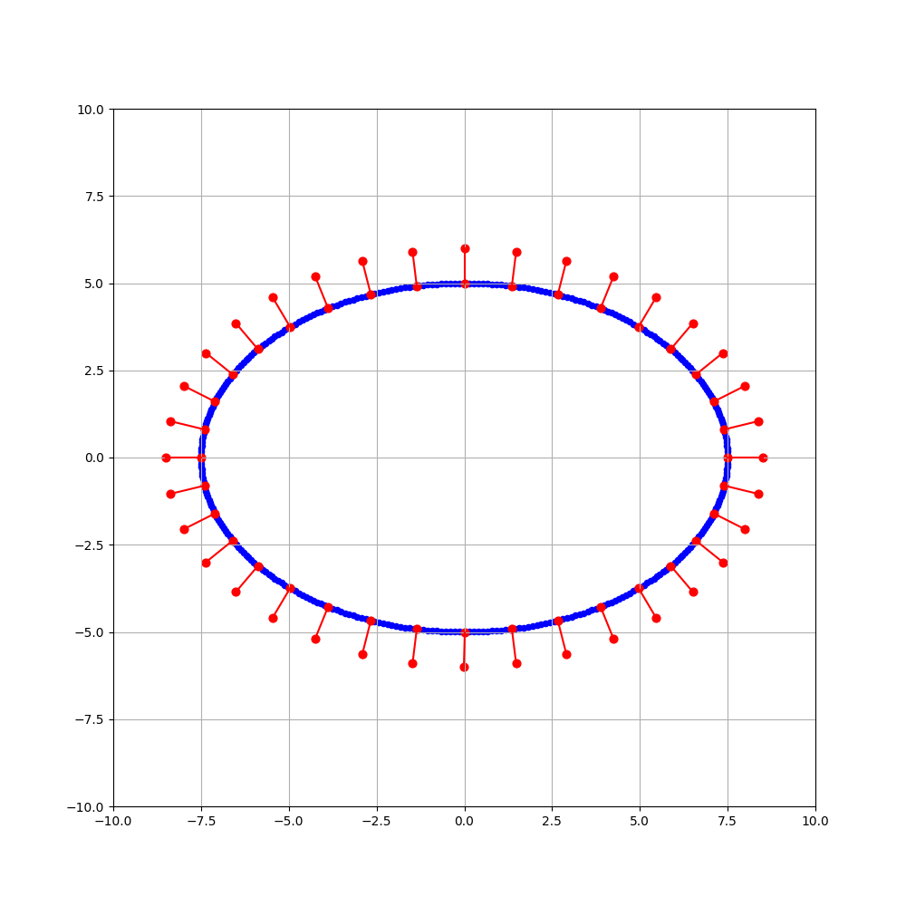

# Analysis of ellipses and 3D computation of circles
When a circular object in a scene is photographed, it becomes an ellipse in the image. By fitting the equation for an ellipse, the three-dimensional properties of a circular object in a scene can be calculated.

<br><br>

## Intersection of ellipses
Summarize the calculation of the intersection of two ellipses. The formula for an ellipse (conic) is as follows.

$$
Ax^2+2Bxy+Cy^2+2f_0(Dx+Ey)+f_0^2F=0 \tag{1}
$$

Eq(1) can be written using the vector $x$ and matrix $Q$ as

$$
(x,Qx)=0, \quad
x=\begin{pmatrix}
x/f_0 \\
y/f_0 \\
1 \\
\end{pmatrix}, \quad
Q=\begin{pmatrix}
A & B & D \\
B & C & E \\
D & E & F \\
\end{pmatrix} \tag{2}
$$

When $|Q|=0$, it is a real or imaginary bilinear line; when $|Q|\neq0$, it is an ellipse, parabola, or hyperbola. These curves are collectively called conic; when two ellipses $(x,Q_1x)=0, (x,Q_2x)=0$ intersect, their intersection can be calculated as follows. The point of intersection is a real number of points.

<br><br>

## Algorithm

### 1. Calculate the solution of one of the following cubic equations for $\lambda$

$$
|\lambda Q_1+Q_2|=0 \tag{3}
$$

Let $\tilde{A}$ be the cofactor matrix, the following equation holds for any square matrices $A$ and $B$, so we compute the $\lambda$ that satisfies this equation.

$$
|\lambda A + B|=\lambda ^3|A|+\lambda ^2tr[\tilde{A}B]+\lambda tr[A\tilde{B}]+|B|=0
$$

### 2. Find the quadratic line representing the quadratic expression of $x,y$ for its $\lambda$

$$
(x,(\lambda Q_1+Q_2)x)=0 \tag{4}
$$

Factorizing Eq(1) with respect to $x$, we obtain

$$
A(x-\frac{-(By+Df_0)+\sqrt{B^2-AC}y+f_0(BD-AE)/\sqrt{B^2-AC}}{A}) \\
(x-\frac{-(By+Df_0)-\sqrt{B^2-AC}y-f_0(BD-AE)/\sqrt{B^2-AC}}{A})=0
$$

Thus, the resulting two straight lines are as follows.

$$
Ax+(B-\sqrt{B^2-AC})y+(D-\frac{BD-AE}{\sqrt{B^2-AC}})f_0=0, \\
Ax+(B+\sqrt{B^2-AC})y+(D+\frac{BD-AE}{\sqrt{B^2-AC}})f_0=0
$$

### 3. Return the intersection of each line and ellipse.
If $n_1x+n_2y+n_3f_0=0$, the straight line obtained in step 2, then if $|n2|\geq|n1|$, substitute $y=-(n_1x+n_3f_0)/n_2$ to obtain the following quadratic equation. Using the two solutions $x$ of this equation, we also obtain $y$.

$$
(An_2^2-2Bn_1n_2+Cn_1^2)x^2+2f_0(Dn_2^2+Cn_1n_3-Bn_2n_3-En_1n_2)x+(Cn_3^2-2En_2n_3+Fn_2^2)f_0^2=0
$$

Do the same for $|n2|<|n1|$ to obtain the following quadratic equation, which we solve for $y$ and use $y$ to find $x$ as well.

$$
(An_2^2-2Bn_1n_2+Cn_1^2)y^2+2f_0(En_1^2+An_2n_3-Bn_1n_3-Dn_1n_2)y+(An_3^2-2Dn_1n_3+Fn_1^2)f_0^2=0
$$

<br></br>

## Explanation

If there is an intersection x between the two ellipses $(x,Q_1x)=0, (x,Q_2x)=0$, it presents to any $\lambda$ and satisfies $\lambda(x,Q_1x)+(x,Q_2x)=0$. That is, Eq(4) is satisfied. This represents the curve or line passing through all intersections of the two ellipses. If we choose $\lambda$ to satisfy Eq(3), then this is a real or imaginary two-line equation. Since we assume that real intersections exist, we can factorize this to obtain the two lines through the intersections. Hence, we can calculate the intersection of each line and one of the ellipses.

You can calculate the intersection of ellipses by running follow command.

```bash
python3 calculate_ellipse_intersection.py
```

The red points are the intersections.



<br></br>

## Foot of perpendicular line to ellipse
The point closest to the ellipse from the perpendicular line is calculated using geometric distance minimization, and this point is the foot of the perpendicular line.

More information on geometric distance minimization can be found [here](https://link.springer.com/chapter/10.1007/978-3-031-01815-2_3).

You can calculate the foot of perpendicular line to ellipse by running follow command.

```bash
python3 calculate_foot_of_perpendicular_line.py
```



<br></br>

## References
- [3D Computer Vision Computation Handbook](https://www.morikita.co.jp/books/mid/081791)
- [Elliptic approximation by the least-squares method](https://imagingsolution.blog.fc2.com/blog-entry-20.html)
