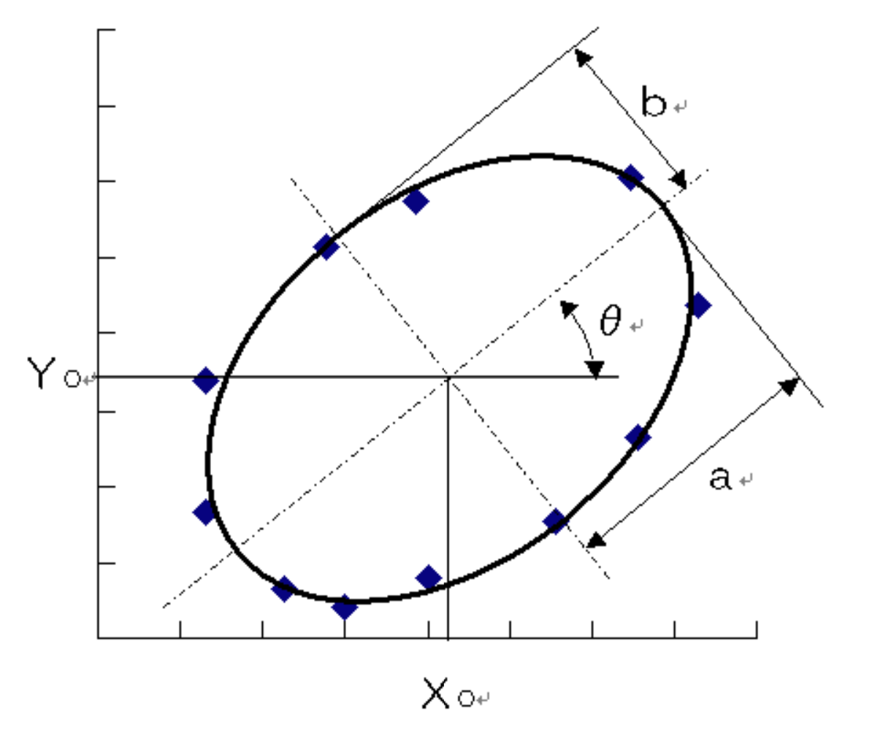
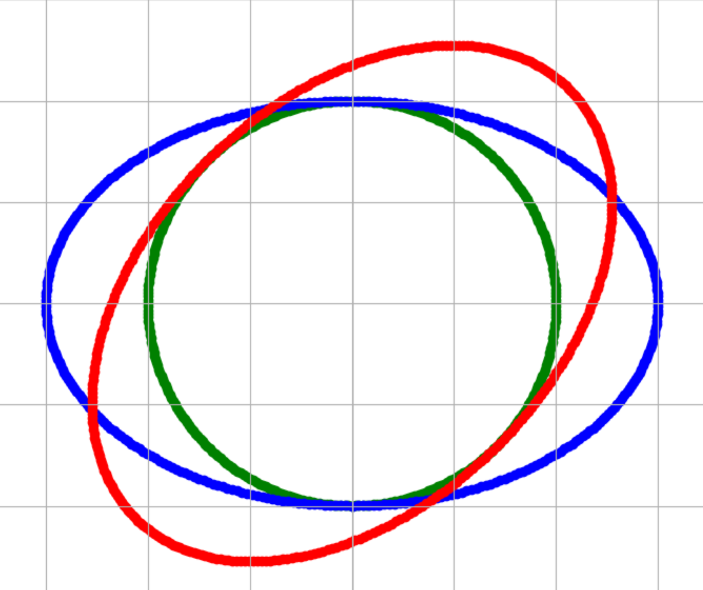
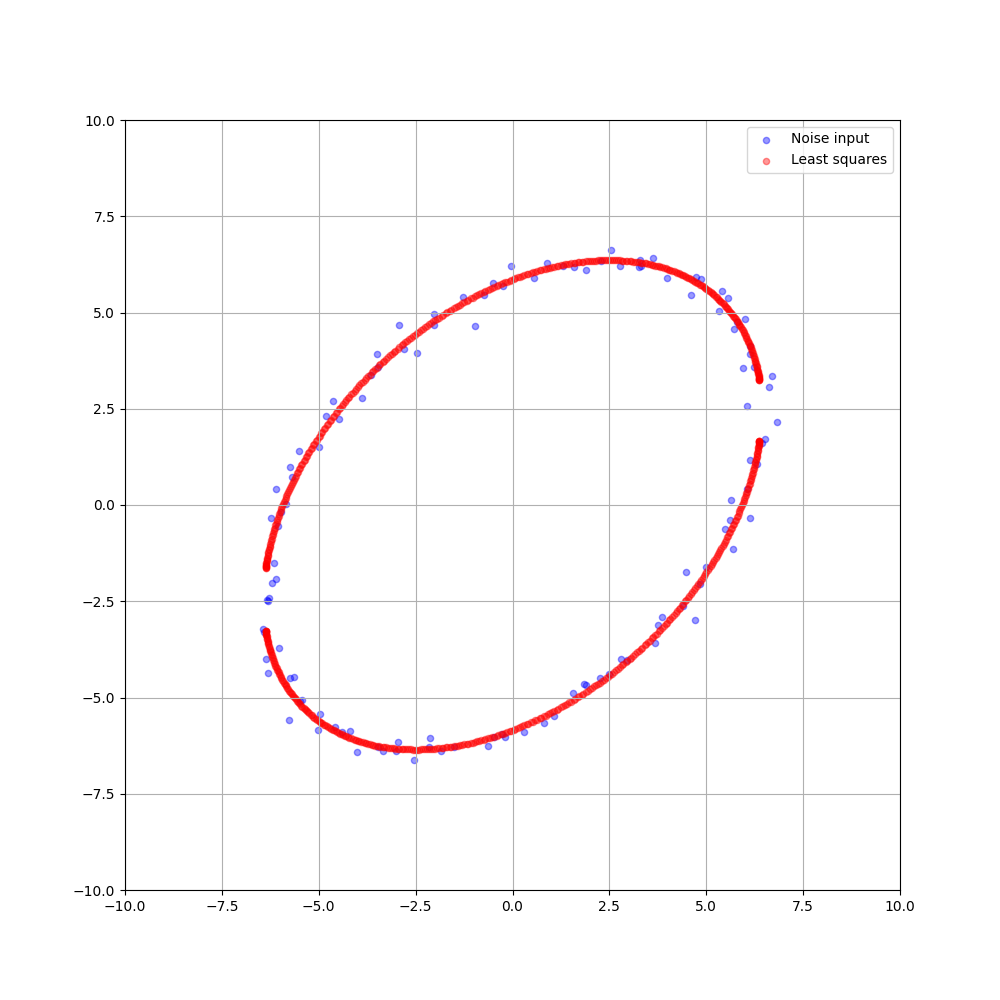
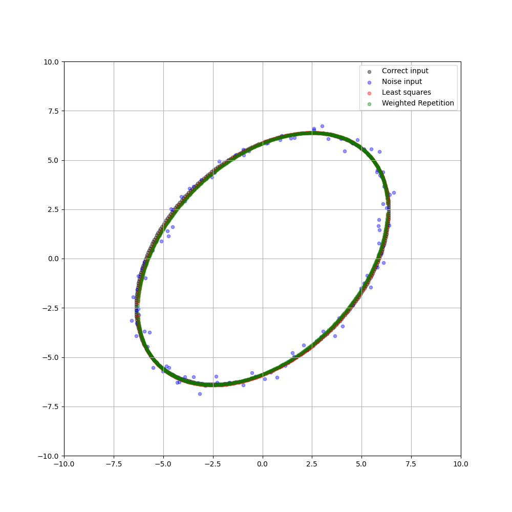
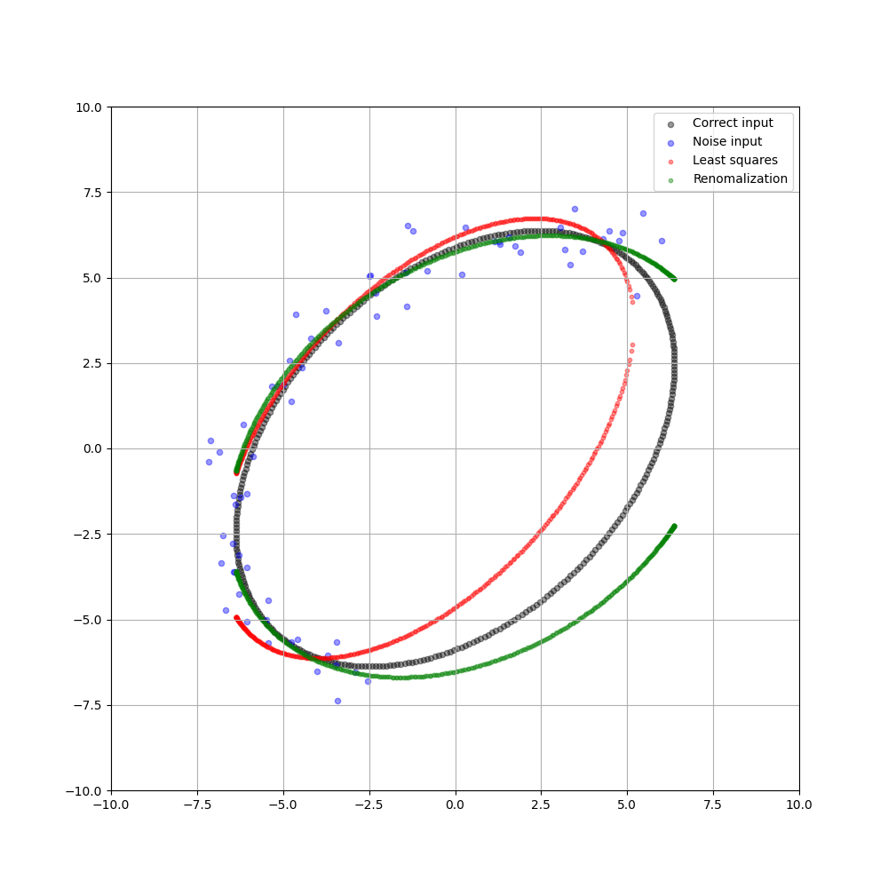
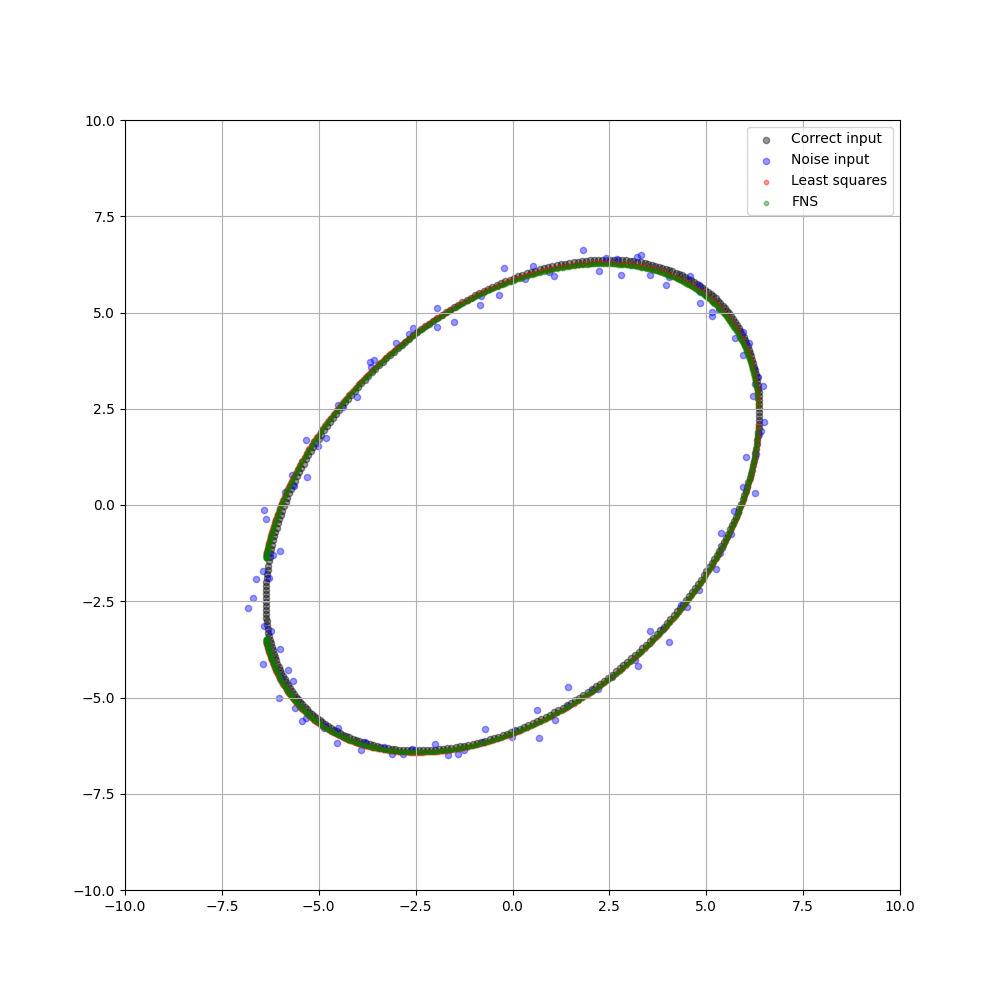
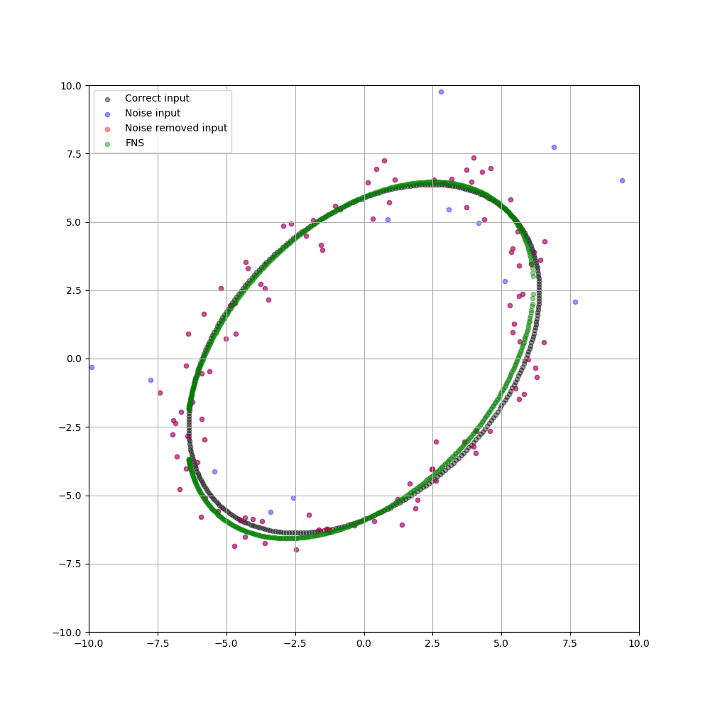

# Elliptic fitting
When a circular object in a scene is photographed, it becomes an ellipse on the image plane, and the 3D position of the object can be analyzed from its shape. Therefore, fitting an ellipse to a sequence of points extracted from an image is one of the basic processes for various applications, including camera calibration and visual robot control.

<br></br>
## Elliptic Formula
The usual formula for an ellipse is as follows.  
Let the center of the ellipse be (Xc, Yc), the length along the x-axis be a, the length along the y-axis be b, and the slope of the ellipse be θ.

$$
\frac{((X-X_c)cos\theta+(Y-Y_c)sin\theta)^2}{a^2}+\frac{(-(X-X_c)sin\theta+(Y-Y_c)cos\theta)^2}{b^2}=1
$$

<br></br>




<br></br>
Let's draw circle and elliptic!

```bash
python3 draw_elliptic.py
```



<br></br>

## Ellipse representation
The ellipse on the image can be written as follows using the formula.

$$
Ax^2+2Bxy+Cy^2+2f_0(Dx+Ey)+f_0^2F=0...(1)
$$

$f_0$ is a constant that adjusts the scale. It is convenient for $x/f_0$ and $y/f_0$ to be about 1.

Define the following 6-dimensional vector

$$
\xi=\begin{pmatrix}
x^2 \\
2xy \\
y^2 \\
2f_0x \\
2f_0y \\
f_0^2 \\
\end{pmatrix},
\theta=\begin{pmatrix}
A \\
B \\
C \\
D \\
E \\
F \\
\end{pmatrix}...(2)
$$

and write the inner product of vectors a and b as (a, b), Eq(1) can be written as

$$
(\xi,\theta)=0...(3)
$$

<br></br>

## **Solution1: Least squares method**
Fitting an ellipse of the form of Eq(1) to data points $(x_1,y_1),...,(x_N,y_N)$ with error is to compute A, B, C, D, E, and F in the following equation.

$$
Ax_\alpha^2+2Bx_\alpha y_\alpha+Cy_\alpha^2+2f_0(Dx_\alpha+Ey_\alpha)+f_0^2F\approx0, \alpha=1,..,N...(4)
$$

Using Eq(3), Eq(4) can be written as

$$
(\xi_\alpha,\theta)\approx0, \alpha=1,..,N...(5)
$$

The method to compute $\theta$ using least squeares method is shown below.

### **1. Compute 6x6 matrix $M$**

$$
M=\frac{1}{N}\sum_{\alpha=1}^N\xi_\alpha\xi_\alpha^\intercal...(6)
$$

### **2. Solve the eigenvalue problem and return the unit eigenvector $\theta$ for the smallest eigenvalue $\lambda$**

$$
M\theta=\lambda\theta...(7)
$$

This minimizes the following sum of squares under the condition $||\theta||=1$.

$$
J=\frac{1}{N}\sum_{\alpha=1}^N(\xi_\alpha,\theta)^2=\frac{1}{N}\sum_{\alpha=1}^N\theta^\intercal\xi_\alpha\xi_\alpha^\intercal\theta=(\theta,M\theta)...(8)
$$

This is the quadratic form of $\theta$. The unit vector $\theta$ that minimizes it is given by the unit vector for the smallest eigenvalue of the coefficient matrix $M$.

The following commands can be used to perform a series of processes.

```bash
python3 elliptic_fitting_by_least_squares.py
```

From the blue points with errors, $\theta$ is calculated and an ellipse is drawn in the below image.



The least squares method is simple but less accurate, and when the point sequence covers only part of the ellipse, it is easy to fit a small, flat ellipse that is far from the true shape.

<br></br>

## Error and covariance matrix
The reason for the low accuracy of the least-squares method is that it does not take into account the nature of the errors in the data at all. Therefore, the nature of the error is explicitly described.
The data $x_\alpha$, $y_\alpha$ can be written as its true value $\bar{x_\alpha}$, $\bar{y_\alpha}$ plus the error $\triangle x$, $\triangle y$ as follows.

$$
x_\alpha=\bar{x_\alpha}+\triangle x,y_\alpha=\bar{y_\alpha}+\triangle y...(9)
$$

Substituting these into $\xi_\alpha$, we obtain

$$
\xi_\alpha=\bar{\xi_\alpha}+\triangle_1\xi_\alpha+\triangle_2\xi_\alpha...(10)
$$

where $\bar{\xi_\alpha}$ is the true value and $\triangle_1\xi_\alpha$ and $\triangle_2\xi_\alpha$ are the first and second order error terms, respectively. Expanding it , we obtain the following.

$$
\triangle_1\xi_\alpha=\begin{pmatrix}
2\bar{x_\alpha}\triangle x_\alpha \\
2\triangle x_\alpha\bar{y_\alpha}+2\bar{x_\alpha}\triangle y_\alpha \\
2\bar{y_\alpha}\triangle y_\alpha \\
2f_0\triangle x_\alpha \\
2f_0\triangle y_\alpha \\
0 \\
\end{pmatrix},
\triangle_2\xi_\alpha=\begin{pmatrix}
\triangle x_\alpha^2 \\
2\triangle x_\alpha y_\alpha \\
\triangle y_\alpha^2 \\
0 \\
0 \\
0 \\
\end{pmatrix}...(11)
$$

Considering the errors $\triangle x_\alpha$ and $\triangle y_\alpha$ as random variables, the covariance matrix of $\xi_\alpha$ is defined as follows.

$$
V[\xi_\alpha]=E[\triangle_1\xi_\alpha\triangle_1\xi_\alpha^T]...(12)
$$

$E$ represents the expected value of that distribution. if $\triangle x_\alpha$ and $\triangle y_\alpha$ follow a normal distribution with expectation 0 and standard deviation $\sigma$, independent of each other, then the following equation holds

$$
E[\triangle x_\alpha]=E[\triangle y_\alpha]=0, E[\triangle x_\alpha^2]=E[\triangle y_\alpha^2]=\sigma^2, E[\triangle x_\alpha\triangle y_\alpha]=0...(13)
$$

Using Eq(11), Eq(12) can be written as follows

$$
V[\xi_\alpha]=\sigma^2V_0[\xi_\alpha], V_0[\xi_\alpha]=4\begin{pmatrix}
\bar{x_\alpha}^2 & \bar{x_\alpha}\bar{y_\alpha} & 0 & f_0\bar{x_\alpha} & 0 & 0 \\
\bar{x_\alpha}\bar{y_\alpha} & \bar{x_\alpha}^2+\bar{y_\alpha}^2 & \bar{x_\alpha}\bar{y_\alpha} & f_0\bar{y_\alpha} & f_0\bar{x_\alpha} & 0\\
0 & \bar{x_\alpha}\bar{y_\alpha} & \bar{y_\alpha}^2 & 0 & f_0\bar{y_\alpha} & 0 \\
f_0\bar{x_\alpha} & f_0\bar{y_\alpha} & 0 & f_0^2 & 0 & 0 \\
0 & f_0\bar{x_\alpha} & f_0\bar{y_\alpha} & 0 & f_0^2 & 0 \\
0 & 0 & 0 & 0 & 0 & 0 \\
\end{pmatrix}...(14)
$$

Since all the elements are multiplied by $\sigma^2$, we take them out, write them as $V_0[\xi_\alpha]$, and call it the normalized covariance matrix.
The diagonal elements of the covariance matrix $V[\xi_\alpha]$ represent how error-prone each element in Eq(2) is, and the off-diagonal elements measure the correlation between the two elements.
Although the covariance matrix in Eq(12) uses only $\triangle_1\xi_\alpha$, it is known that adding $\triangle_2\xi_\alpha$ has little effect on subsequent results. This is because $\triangle_2\xi_\alpha$ is extremely small compared to $\triangle_1\xi_\alpha$. Also, $V_0[\xi_\alpha]$ in Eq(14) uses the true values x,y, but is replaced by the observed values $\bar{x_\alpha}$, $\bar{y_\alpha}$ in the actual calculation. This also has little effect on the results.  
In the following, I will show various methods to improve the accuracy of the least squares method, taking into account the statistical nature of the error described by this covariance matrix.

<br></br>

## **Solution2: Iterative reweight**
### **1. Define $\theta_0=0$ and $W_\alpha=1$($\alpha=1,...,N$).**
### **2. Calculate 6×6 matrix M.**

$$
M=\frac{1}{N}\sum_{\alpha=1}^NW_\alpha\xi_\alpha\xi_\alpha^\intercal...(15)
$$

### **3. Solve eigenvalue problem and calculate the unit eigenvector $\theta$ for the minimum eigenvalue $\lambda$.**

$$
M\theta=\lambda\theta...(16)
$$

### **4. Return $\theta$ if $\theta\approx\theta_0$ except for the sign. Otherwise, return the step2 after updating $W_\alpha$ and $\theta_0$.**

$$
W_\alpha\leftarrow\frac{1}{(\theta,V_0[\xi_\alpha]\theta)},\theta_0\leftarrow\theta...(17)
$$

According to statistics, it is known that it is optimal to take the weight $W\alpha$ to be proportional to the inverse of the variance of each term (thus, the term with the smallest error is larger and the term with the largest error is smaller).

The following commands can be used to perform a series of processes.

```bash
python3 elliptic_fitting_by_weighted_repetition.py
```

The following is a description of each of the points in the image below.
- The blue points are points with errors.
- The black points are true points.
- The red points are estimated points by least square.
- The green points are estimated points by iterative reweight



<br></br>

## **Solution3: Renormalization**
### **1. Define $\theta_0=0$ and $W_\alpha=1$($\alpha=1,...,N$).**
### **2. Calculate 6×6 matrix M and N.**

$$
M=\frac{1}{N}\sum_{\alpha=1}^NW_\alpha\xi_\alpha\xi_\alpha^\intercal, N=\frac{1}{N}\sum_{\alpha=1}^NW_\alpha V_0[\xi_\alpha]...(18)
$$

### **3. Solve general eigenvalue problem and calculate the unit general eigenvector $\theta$ for the minimum general eigenvalue $\lambda$.**

$$
M\theta=\lambda N\theta...(19)
$$

### **4. Return $\theta$ if $\theta\approx\theta_0$ except for the sign. Otherwise, return the step2 after updating $W_\alpha$ and $\theta_0$.**

$$
W_\alpha\leftarrow\frac{1}{(\theta,V_0[\xi_\alpha]\theta)},\theta_0\leftarrow\theta...(20)
$$

Renormalization is a method that improves on the inaccuracy when the elliptical arcs to be fitted are short.  
Program tools that solve general eigenvalue problems of the form in Eq(19) usually assume that $N$ is a positive-valued symmetric matrix, but as can be seen from Eq(14), $V_0[\xi_\alpha]$ is not positive-valued. Therefore, $N$ is not positive-valued. 
However, equation (19) can be rewritten as

$$
N\theta=\frac{1}{\lambda}M\theta...(21)
$$

If there are errors in the data, $M$ is a positive-valued symmetric matrix, so the program tool can be applied. The unit general eigenvector $\theta$ for the largest general eigenvalue $\frac{1}{\lambda}$ is then calculated.

The following commands can be used to perform a series of processes.

```bash
python3 elliptic_fitting_by_renormalization.py
```

The following is a description of each of the points in the image below.
- The blue points are points with errors. Some elliptical arcs are missing.
- The black points are true points.
- The red points are estimated points by iterative reweight.
- The green points are estimated points by renormalization.



<br></br>

## **Solution4: FNS(Fundamental Numerical Scheme) method**
### **1. Define $\theta=\theta_0=0$ and $W_\alpha=1$($\alpha=1,...,N$).**
### **2. Calculate 6×6 matrix M and L.**

$$
M=\frac{1}{N}\sum_{\alpha=1}^NW_\alpha\xi_\alpha\xi_\alpha^\intercal, L=\frac{1}{N}\sum_{\alpha=1}^NW_\alpha^2(\xi_\alpha,\theta)^2 V_0[\xi_\alpha]...(22)
$$

### **3. Define matrix $X$ as $M - L$**
$$
X=M-L...(23)
$$

### **4. Solve eigenvalue problem and calculate the unit eigenvector $\theta$ for the minimum eigenvalue $\lambda$.**
$$
X\theta=\lambda\theta...(24)
$$

### **5. Return $\theta$ if $\theta\approx\theta_0$ except for the sign. Otherwise, return the step2 after updating $W_\alpha$ and $\theta_0$.**

$$
W_\alpha\leftarrow\frac{1}{(\theta,V_0[\xi_\alpha]\theta)},\theta_0\leftarrow\theta...(25)
$$

The FNS method calculates $θ$, where the gradient is zero for the Sampson error $J=\frac{1}{N}\sum_{\alpha=1}^N\frac{1}{(\xi_\alpha,\theta)^2}$, which represents the geometric distance.

$$
J=\frac{1}{N}\sum_{\alpha=1}^N\frac{(\xi_\alpha,\theta)^2}{(\theta,V_0[\xi_\alpha]\theta)}...(26)
$$

$$
\triangledown_\theta J=2(M-L)\theta=2X\theta...(27)
$$

The following commands can be used to perform a series of processes.

```bash
python3 elliptic_fitting_by_fns.py
```

The following is a description of each of the points in the image below.
- The blue points are points with errors.
- The black points are true points.
- The green points are estimated points by FNS method.



<br></br>

## **Solution5: Robust fitting by RANSAC**
The actual image may not necessarily consist only of points on the ellipse, but may include the boundaries of other objects. Such a sequence of pixels that does not form an ellipse is called an outlier. In contrast, pixels that form an ellipse are called inliers. Fitting that is not easily affected by outliers is called "Robust fitting". A typical method is RANSAC(Random Sample Consensus).

### **1. Randomly select 5 points from the input pixel sequence and let $\xi_1,...,\xi_5$ be the vector of Eq(2) for them.**

### **2. Solve eigenvalue problem and calculate the unit eigenvector $\theta$ for the minimum eigenvalue.**

$$
M_5=\sum_{\alpha=1}^5\xi_\alpha\xi_\alpha^\intercal...(28)
$$

### **3. For the ellipse $\theta$, record the number of pixels in the input pixel sequence that satisfy the following equation, where $d$ is a threshold for how much deviation from the fitted ellipse is acceptable.**

$$
\frac{(\xi_\alpha,\theta)^2}{(\theta,V_0[\xi_\alpha]\theta)} < d^2...(29)
$$

### **4. Randomly select another 5 points from the input pixel sequence and perform the same operation. Do this many times and select the one with the largest n among the candidate ellipses.**

### **5. For the finally chosen ellipse, pixels that do not satisfy Eq(29) are considered outliers and removed.**

The following commands can be used to perform a series of processes.

```bash
python3 remove_outlier_by_ransac.py
```

The following is a description of each of the points in the image below.
- The blue dot is the point considered an outlier.
- The red dot is the point considered an inlier.
- The black points are true points.
- The green points are estimated points by FNS method with RANSAC.



<br></br>

## References
- [3D Computer Vision Computation Handbook](https://www.morikita.co.jp/books/mid/081791)
- [For Three-Dimensional Understanding of Images Optimization Calculation [II]](http://iim.cs.tut.ac.jp/member/kanatani/papers/ieicefit2.pdf)
- [Elliptic approximation by the least-squares method](https://imagingsolution.blog.fc2.com/blog-entry-20.html)
