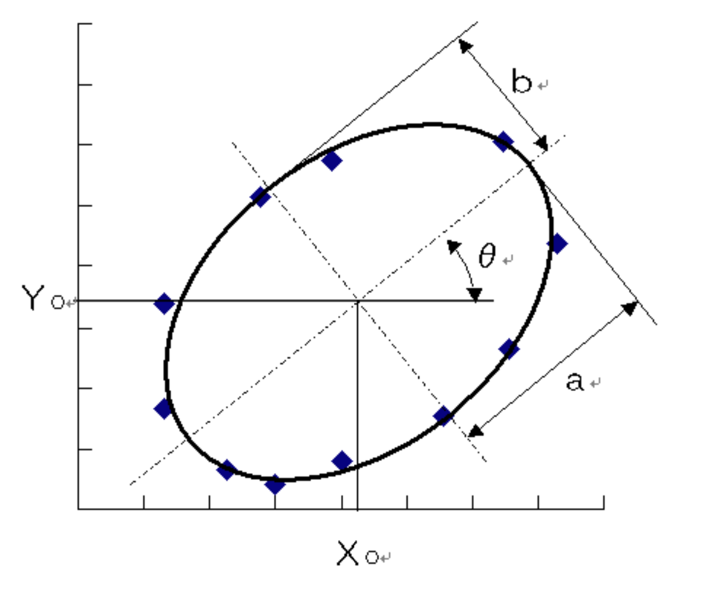

# Elliptic fitting
When a circular object in a scene is photographed, it becomes an ellipse on the image plane, and the 3D position of the object can be analyzed from its shape. Therefore, fitting an ellipse to a sequence of points extracted from an image is one of the basic processes for various applications, including camera calibration and visual robot control.

<br></br>
## Elliptic Formula
The usual formula for an ellipse is as follows.  
Let the center of the ellipse be (Xc, Yc), the length along the x-axis be a, the length along the y-axis be b, and the slope of the ellipse be θ.

$$
\frac{((X-X_c)cos\theta+(Y-Y_c)sin\theta)^2}{a^2}+\frac{(-(X-X_c)sin\theta+(Y-Y_c)cos\theta)^2}{b^2}=1
$$

<br></br>




<br></br>
Let's draw circle and elliptic!

```bash
python3 draw_elliptic.py
```


<br></br>

## Ellipse representation
The ellipse on the image can be written as follows using the formula.

$$
Ax^2+2Bxy+Cy^2+2f_0(Dx+Ey)+f_0^2F=0...(1)
$$

$f_0$ is a constant that adjusts the scale. It is convenient for $x/f_0$ and $y/f_0$ to be about 1.

Define the following 6-dimensional vector

$$
\xi=\begin{pmatrix}
x^2 \\
2xy \\
y^2 \\
2f_0x \\
2f_0y \\
f_0^2 \\
\end{pmatrix},
\theta=\begin{pmatrix}
A \\
B \\
C \\
D \\
E \\
F \\
\end{pmatrix}...(2)
$$

and write the inner product of vectors a and b as (a, b), Eq(1) can be written as

$$
(\xi,\theta)=0...(3)
$$

<br></br>

## **Solution1: Least squares method**
Fitting an ellipse of the form of Eq(1) to data points $(x_1,y_1),...,(x_N,y_N)$ with error is to compute A, B, C, D, E, and F in the following equation.

$$
Ax_\alpha^2+2Bx_\alpha y_\alpha+Cy_\alpha^2+2f_0(Dx_\alpha+Ey_\alpha)+f_0^2F\approx0, \alpha=1,..,N...(4)
$$

Using Eq(3), Eq(4) can be written as

$$
(\xi_\alpha,\theta)\approx0, \alpha=1,..,N...(5)
$$

The method to compute $\theta$ using least squeares method is shown below.

### **1. Compute 6x6 matrix $M$**

$$
M=\frac{1}{N}\sum_{\alpha=1}^N\xi_\alpha\xi_\alpha^\intercal
$$

### **2. Solve the eigenvalue problem and return the unit eigenvector $\theta$ for the smallest eigenvalue $\lambda$**

$$
M\theta=\lambda\theta
$$

Minimize the following sum of squares under condition $||\theta||=1$.

$$
J=\frac{1}{N}\sum_{\alpha=1}^N(\xi_\alpha,\theta)^2=\frac{1}{N}\sum_{\alpha=1}^N\theta^\intercal\xi_\alpha\xi_\alpha^\intercal\theta=(\theta,M\theta)
$$

This is the quadratic form of $\theta$. The unit vector $\theta$ that minimizes it is given by the unit vector for the smallest eigenvalue of the coefficient matrix $M$.

The following commands can be used to perform a series of processes.

```bash
python3 elliptic_fitting_by_least_squares.py
```

From the blue points with errors, $\theta$ is calculated and an ellipse is drawn in the below image.


The least squares method is simple but less accurate, and when the point sequence covers only part of the ellipse, it is easy to fit a small, flat ellipse that is far from the true shape.

<br></br>
## References
- [3D Computer Vision Computation Handbook](https://www.morikita.co.jp/books/mid/081791)
- [Elliptic approximation by the least-squares method](https://imagingsolution.blog.fc2.com/blog-entry-20.html)
