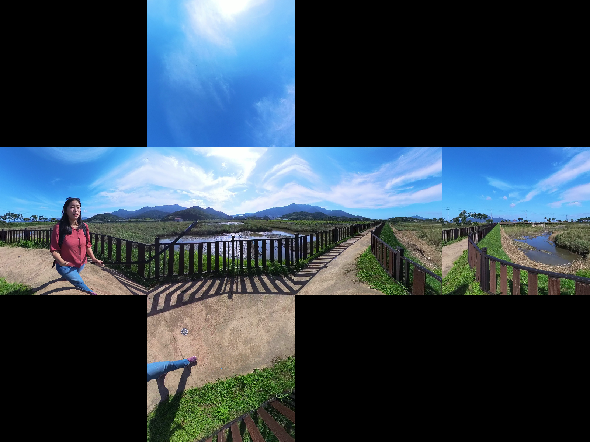
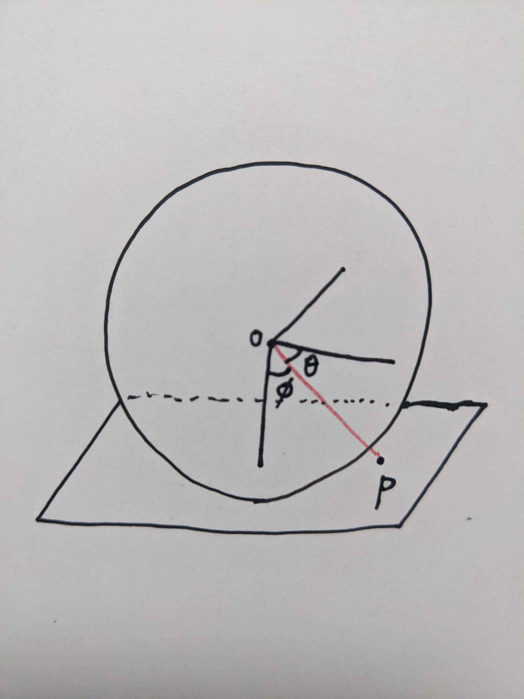
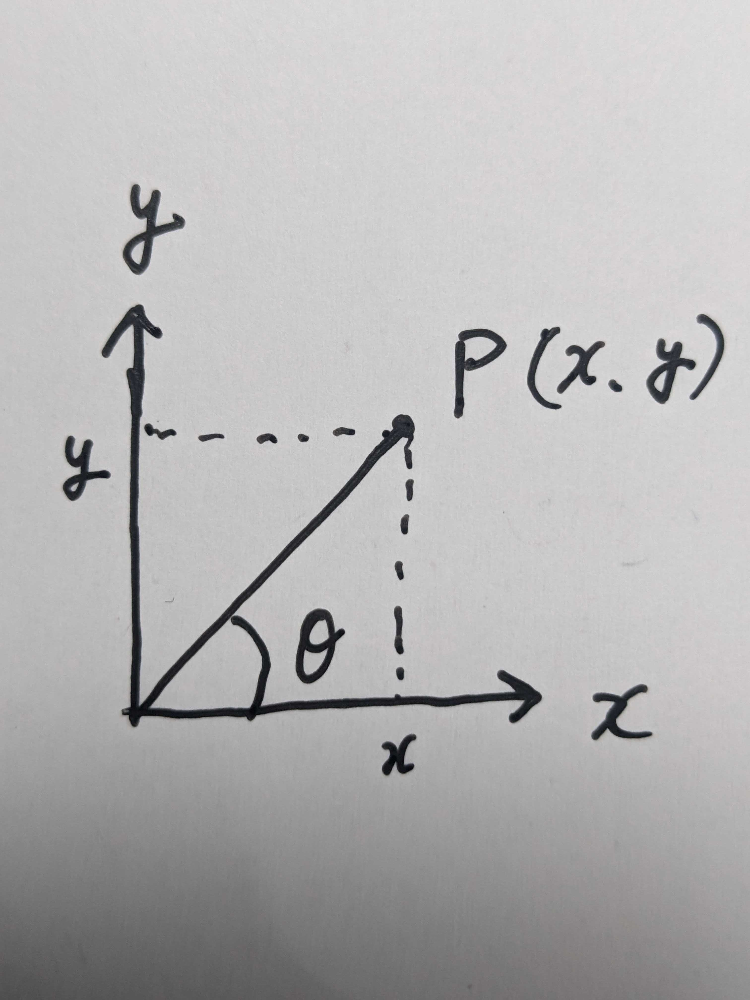
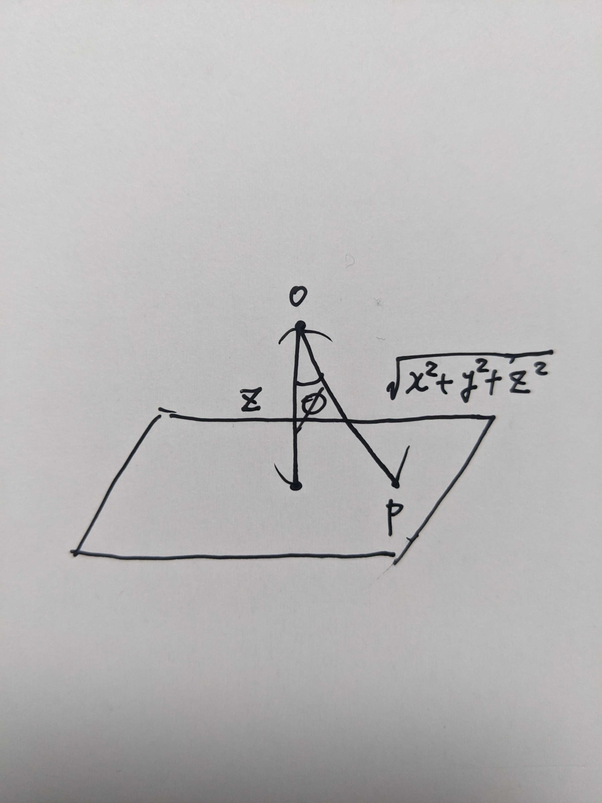

# equirectangular_to_cubemap
The equirectangular format is often used as a format for viewing 360-degree videos.


<br></br>

However, equirectangular images have bottom and top pixels that take up a lot more area than they should, and as a result they are distorted.  
The distortion can be eliminated by converting the equirectangular image into a format called a cube map, which divides the image into six planes.



<br></br>

## Algorithm
Create 6 images and attach them at the end to create a cubemap. This time, I will show you how to create the bottom image. Images of other surfaces can be created in the same way.

### **1. Create the imaging plane**
For the bottom surface, fix the vector in the z-axis direction. The face size is the output image size.

<br></br>

### **2. Calculate latitude and longitude of 3D vector**
For each pixel of a surface, compute its vector from the center and calculate its latitude and longitude.



<br></br>

To calculate longitude, calculate the arctan of the x,y components.

$$
\theta=\arctan\frac{y}{x}
$$



<br></br>

To calculate the latitude, calculate the z component and the vector scalar arccos.

$$
\phi=\arccos\frac{z}{\sqrt{x^2+y^2+z^2}}
$$



<br></br>

### **3. Calculate the position on the equirectangular image using latitude and longitude**
The latitude and longitude obtained in the previous step are normalized by the overall angle in the vertical and horizontal directions and then multiplied by the overall pixels in the two directions to obtain the pixel values on the equirectangular image.

$$
output_x[pixel]=\frac{\theta}{2\pi}\times input_{width}
$$

$$
output_y[pixel]=\frac{\phi}{\pi}\times input_{height}
$$

<br></br>

## How to run
You can create a cubemap by executing the command below.

```bash
python3 equirectangular_to_cubemap.py
```

<br></br>

## Dataset
- [Insta360 X3 vs X2 Camera Review | DOWNLOAD REAL Footage](https://www.youtube.com/watch?v=gsQcw1NZDR4)
- [Dataset in Google Drive](https://drive.google.com/drive/folders/1HnwAKZAkJ8ZKL8S-IBMWmDN71RWK3ll8)

<br></br>

## Referrence
- [Converting to/from cubemaps](http://paulbourke.net/panorama/cubemaps/)
