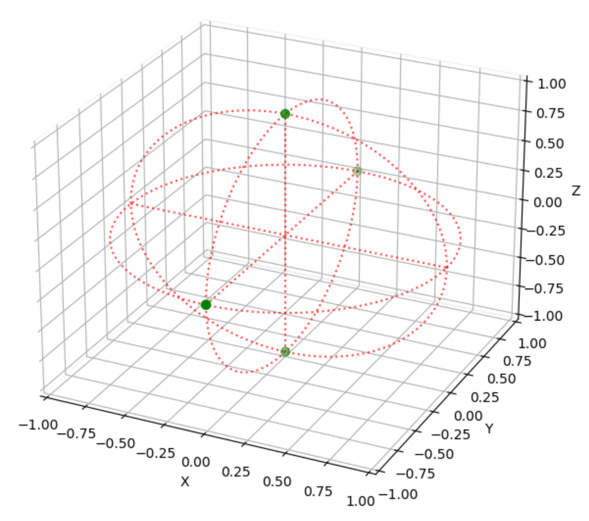
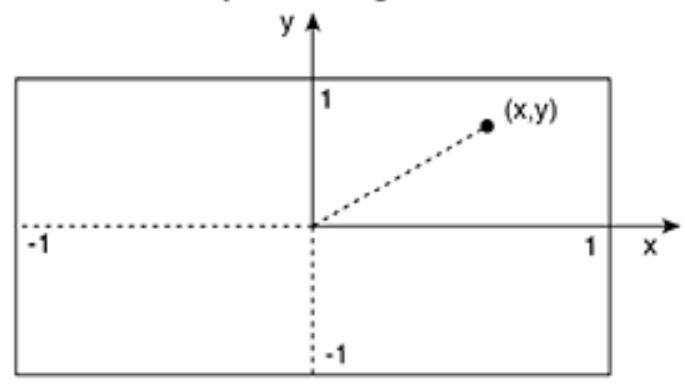
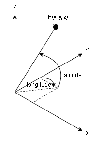

# equirectangular_to_sphere
Converting the coordinates on the equirectangular image to 3D coordinates on a sphere is very important to know the positional relationship between the camera and the target object.
Here is a summary of how it is done.

From


To



<br></br>

## Algorithm

### **1. Normalize equirectangular coordinates**
If the origin is at the upper left, the following transformation is performed.



$$
center_x=equi_x-width/2 + 0.5 \\
center_y=(-1)*equi_y+height/2+0.5
$$

$$
norm_x=center_x/(width/2-0.5) \\
norm_y=center_y/(height/2-0.5)
$$

<br></br>

### **2. Calculate longitude and latitude**
Since the normalized x, y values take -1~1, we can multiply $\pi$ for longitude and $\pi/2$ for latitude by x,y.



$$
longitude=norm_x*\pi \\
latitude=norm_y*\frac{\pi}{2}
$$

### **3. Calculate 3D vector**
Using longitude and latitude, we can calculate spherical coordinates of radius 1.

$$
x=cos(latitude)*sin(longitude) \\
y=cos(latitude)*cos(longitude) \\
z=sin(latitude)
$$

<br></br>

## Code
You can try the calculation by running following command.

```bash
python3 equirectangular_to_sphere.py
```

Each points([0, height/2-1], [width/2-1, 0], [width/2-1, height/2-1], [width/2-1, height-1], [width-1, height/2-1]) in the image is transformed into a spherical coordinate system as shown in the image below.


<br></br>

## Referrence
- [Converting dual fisheye images into a spherical (equirectangular) projection](http://paulbourke.net/dome/dualfish2sphere/)

<br></br>

## Dataset
- [Insta360 X3 vs X2 Camera Review | DOWNLOAD REAL Footage](https://www.youtube.com/watch?v=gsQcw1NZDR4)
