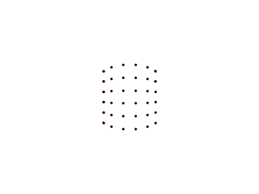

# Self-calibration of perspective camera
We describe a method for self-calibrating a perspective projection camera.
First, we show that if we give an unknown called **projective depth** to each point, we can apply the same **factorization method** as in the case of an affine camera. This projective depth is determined so that the observation matrix can be factorized. As a calculation method, we implement a **primary method** that iteratively determines the projective depth so that the column rank of the observation matrix becomes 4.

Imaging by a perspective projection camera is described by the following equation. The unknown constant $z_{\alpha k}$ is called the projective depth.

$$
z_{\alpha k}
\begin{pmatrix}
x_{\alpha k}/f_0 \\
y_{\alpha k}/f_0 \\
1 \\
\end{pmatrix}\simeq
P_kX_\alpha \tag{1}
$$

$X_\alpha$ on the right side is a four-dimensional vector in which the three-dimensional coordinates of the $\alpha$ point $X_\alpha, Y_\alpha, Z_\alpha$ and a constant $1$ are arranged, but if we introduce an unknown projective depth $z_{\alpha k}$, there is no need to consider the condition that the fourth component of vector $X_\alpha$ is $1$. This is because multiplying $X_\alpha$ by a constant is the same as multiplying $z_{\alpha k}$ by a constant.  
Therefore, the position of a point in three-dimensional space is expressed by the ratio of the components of $X$, $X_{\alpha (1)}:X_{\alpha (2)}:X_{\alpha (3)}:X_{\alpha (4)}$. This is called homogeneous coordinates. The actual three-dimensional position $(X_\alpha, Y_\alpha, Z_\alpha)$ is calculated as follows.

$$
X_\alpha=\frac{X_{\alpha (1)}}{X_{\alpha (4)}}, \quad Y_\alpha=\frac{X_{\alpha (2)}}{X_{\alpha (4)}}, \quad Z_\alpha=\frac{X_{\alpha (3)}}{X_{\alpha (4)}} \tag{2}
$$

When the fourth component $X_{\alpha (4)}$ of $X_\alpha$ is $0$, it is interpreted that $X_\alpha$ represents a point at infinity in the $(X_\alpha, Y_\alpha, Z_\alpha)$ direction.

Self-calibration of a perspective projection camera means calculating the homogeneous coordinates $X_\alpha(\alpha=1,...,N)$ of all points and the camera matrix $P_k(k=1,...,M)$ of all cameras from the observation point $(x_{\alpha k},y_{\alpha k})(\alpha=1,...,N,k=1,...,M)$.

<br></br>

# Factorization method
Arrange all observed image coordinates $(x_{\alpha k}, y_{\alpha k})$ and all projective depths $z_{\alpha k}$ in the form of the following matrix.

$$
W=
\begin{pmatrix}
z_{11}x_{11}/f_0 & z_{21}x_{21}/f_0 & ... & z_{N1}x_{N1}/f_0 \\
z_{11}y_{11}/f_0 & z_{21}y_{21}/f_0 & ... & z_{N1}y_{N1}/f_0 \\
z_{11} & z_{21} & ... & z_{N1} \\
... & ... & ... & ... \\
z_{1M}x_{1M}/f_0 & z_{2M}x_{2M}/f_0 & ... & z_{NM}x_{NM}/f_0 \\
z_{1M}y_{1M}/f_0 & z_{2M}y_{2M}/f_0 & ... & z_{NM}y_{NM}/f_0 \\
z_{1M} & z_{2M} & ... & z_{NM} \\
\end{pmatrix} \tag{3}
$$

This $3M\times N$ matrix is called the observation matrix.
Arrange the camera matrix $P_k$ of all cameras and the homogeneous coordinates $X_\alpha$ of all points in the form of the following matrix.

$$
M=
\begin{pmatrix}
P_1 \\
... \\
P_M \\
\end{pmatrix}, \quad
S=(X_1 ... X_N) \tag{4}
$$

$3M\times 4$ matrix $M$ is called the **motion matrix** and $4\times N$ matrix S is called the **shape matrix**.
The following relationship holds from Eq(1) and definitions of $S$ and $M$.

$$
W=MS \tag{5}
$$

Therefore, if the projective $z_{\alpha k}$ is known, the camera matrix $P_k$ and the homogeneous matrix $X_\alpha$ can be determined by decomposing $W$ into the product of $M$ and $S$ using singular value decomposition.
Therefore, find $z_{\alpha k}$ such that matrix $W$ in Eq(3) can be decomposed into the product of a certain $3M\times 4$ matrix $M$ and a certain $4\times N$ matrix $S$.
The condition that the matrix W can be decomposed in this way is that the rank of W is $4$.

In the primary method, $z_{\alpha k}$ is defined so that the N columns of Eq(3) span a 4-dimentional subspace, that is, it can be written as a linear combinatin of $4$ basis vectors.

Once the projective depth $z_{\alpha k}$ is determined, the camera matrix $P_k$ and the 3-dimentional position $X_\alpha$ are determined by factorizing $W$ as follows.


## 1. Singular value decomposition of W

$$
W=U_{3M\times L}\Sigma_L V_{N\times L}^\intercal, \quad
\Sigma=\begin{pmatrix}
\sigma_1 & ... & 0 \\
... & ... & ... \\
0 & ... & \sigma_L \\
\end{pmatrix} \tag{6}
$$

However, $L=min(3M,N)$, and $U_{3M\times L}$ and $V_{N\times L}$ are $3M\times L$ matrix and $N\times L$ matrix consisting of orthogonal columns.
$\Sigma_L$ is the diagonal matrix with singular values $(\sigma_1\geq ...\geq \sigma_L)$ arraned on the diagonal elements.

## 2. Let U be the $3M\times 4$ matrix consisting of the first 4 columns of $U_{3M\times L}$, and let V be the $N\times 4$ matrix consisting of the first 4 columns of $V_{N\times L}$. Then, set $\Sigma$ as follows.

$$
\Sigma=
\begin{pmatrix}
\sigma_1 & 0 & 0 & 0 \\
0 & \sigma_2 & 0 & 0 \\
0 & 0 & \sigma_3 & 0 \\
0 & 0 & 0 & \sigma_4 \\
\end{pmatrix} \tag{7}
$$

## 3. Set the motion matrix $M$ and the shape matrix $S$ as follows

$$
M=U, \quad S=\Sigma V^\intercal \tag{8}
$$

## 4. Set the camera matrix $P_k$ and the 3D position $X_\alpha$ as Eq(4)

If the projective depth $z_{\alpha k}$ is calculated collectly, the rank of the observation matrix W is 4 and the singular values in Eq(6) are $\sigma=0(i=5,...,L)$. But $z_{\alpha k}$ is not exact, this is not completely true. Therefore, set $\sigma=0(i=5,...,L)$ and approximately decompose as $W\approx MS$ by singular value decomposition.

<br></br>

# Primary method
If we set the 3-dimensional vector $x_{\alpha k}$ as follows,

$$
x_{\alpha k}=
\begin{pmatrix}
x_{\alpha k}/f_0 \\
y_{\alpha k}/f_0 \\
1 \\
\end{pmatrix} \tag{9}
$$

the observation matrix $W$ in Eq(3) can be written as follows.

$$
W=
\begin{pmatrix}
z_{11}x_{11} & ... & z_{N1}x_{N1} \\
... & ... & ... \\
z_{1M}x_{1M} & ... & z_{NM}x_{NM} \\
\end{pmatrix} \tag{10}
$$

The primary method that calculate the projective depth $z_{\alpha k}$ is as follows.

## 1. Set allowable reprojection error $\epsilon$ and initialize $z_{\alpha k}=1(\alpha=1,...,N, k=1,...,M)$

## 2. Normalize each columns of the obserbation matrix W in Eq(10) to unit vectors and singular value decompostion. then, let first 4 columns of $U_{3M\times L}$ to $u_1,...,u_4$

## 3. Perform the following calculations
### (a) Define the $M\times M$ matrix $A^{(\alpha)}=(A_{k\lambda}^{(\alpha)})$

$$
A_{k\lambda}^{(\alpha)}=\frac{\sum_{i=1}^4 (x_{\alpha k}, u_{ik})(x_{\alpha \lambda}, u_{i\lambda})}{|x_{\alpha k}||x_{\alpha \lambda}|} \tag{11}
$$

However, $u_{ik}$ is a 3D vector whose first, second, and third components are the $3(k-1)+1$, $3(k-1)+2$, $3(k-1)+3$ components of the $3M$ vector $u_i(i=1,...,4)$.

### (b) Calculate the unit vector $\xi_\alpha=(\xi_{\alpha k})$ corresponding to the max eigen value of the matrix $A^{(\alpha)}$. The sign is chosen as follows.

$$
\sum_{k=1}^M \xi_{\alpha k} \geq 0 \tag{12}
$$

### (c) Update the projective depth $z_{\alpha k}$ as follows
$$
z_{\alpha k} \leftarrow \frac{\xi_{\alpha k}}{|x_{\alpha k|}} \tag{13}
$$

## 4. Set the camera matrix $P_k$ and the 3D position $X_\alpha$ like step3,4 of the factorization method

## 5. Calculate the reprojection error as follows

$$
E=f_0\sqrt{\frac{1}{MN}\sum_{\alpha=1}^N\sum_{k=1}^M |x_{\alpha k}-Z[P_kX_\alpha]|^2} \tag{14}
$$

$Z[]$ represents the normalization let the third component to 1.

## 6. If $E < \epsilon$, finish. Otherwise, return to step2.

Let $z_{\alpha k}=1$ as a initial value equivalent to assume the affine camera.
The projective depth $z_{\alpha k}$ has a constant multiple of indeterminacy because the homogeneous matrix $X_\alpha$ also has it.
Since the space spanned by $N$ columns of $W$ is equal to the space spanned by $N$ columns of matrix $U_{3M\times L}$ of Eq(6), if $z_{\alpha k}$ is correct, each columns of $W$ are included in the 4D space $L_4$.
Set the $\alpha$ column of $W$ to $p_\alpha$, as is well known, its projection to the 4D space $L_4$ is as follows.

$$
\hat{p}_\alpha=\sum_{i=1}^4 (p_\alpha, u_i)u_i \tag{15}
$$


Because $u_1,...,u_4$ are orthonormal bases and $p_\alpha$ is normalized as $|p_\alpha|=1$, the length of perpendicular drawn from $p_\alpha$ to $L_4$.

$$
\sqrt{|p_\alpha|^2-|\hat{p}_\alpha|^2}=\sqrt{1-\sum_{i=1}^4(p_\alpha, u_i)^2} \tag{16}
$$

If $z_{\alpha k}$ is correct, this should be 0, so set $z_{\alpha k}$ to maximize the following equation.

$$
\begin{align*}
J_\alpha&=\sum_{i=1}^4(p_\alpha, u_i)^2=\sum_{i=1}^4\Bigl(\sum_{k=1}^M(z_{\alpha k}x_{\alpha k}, u_{ik})\Bigr)^2 \\
&=\sum_{k,\lambda=1}^M \Bigl( \sum_{i=1}^4(x_{\alpha k}, u_ik)(x_{\alpha \lambda}, u_i\lambda) \Bigr) z_{\alpha k}z_{\alpha \lambda} \tag{17}
\end{align*}
$$

Maximize $J_\alpha$ under the following normalization condition.

$$
|p_\alpha|^2=\sum_{k=1}^M z_{\alpha k}^2|x_{\alpha k}|^2=1 \tag{18}
$$

Define $\xi_{\alpha k}$ as follows and set $M$ dimentional vector $(\xi_{\alpha 1}, ..., \xi_{\alpha M})$ to $\xi_\alpha$, Eq(18) is simply written as $|\xi_\alpha|=1$. The matrix $A^{(\alpha)}$ is defined as Eq(11), Eq(17) can be written as follows.

$$
J_\alpha=\sum_{k,\lambda=1}^M A_{k\lambda}^{(\alpha)} \xi_{\alpha k} \xi_{\alpha \lambda}=(\xi_\alpha, A^{(\alpha)}\xi_\alpha) \tag{19}
$$

This is the quadratic form of $\xi_\alpha$, the unit vector $\xi_\alpha$ that maximize this is the unit eigen vector corresponds to the max eigen value of the matrix $A^{(\alpha)}$. The unit vector has the ambiguity of the sign, choose the sign as Eq(12).

You can try the primary method by running following command.

```bash
python3 calibrate_perspective_camera_by_primary_method.py
```

Black points are input points and red points are reprojected points using calculated the motion matrix and the shape matrix. You can see the 2 types of points almost overlap.




<br></br>

# Euclidean upgrading
$P_k,X_\alpha$ satisfying Eq(1) is not unique. This is because $P'_kX'_\alpha=P_kX_\alpha$ holds even if the following transformation is performed using any $4\times 4$ regular matrix $H$.

$$
P'_k=P_kH, \quad X'_\alpha=H^-X_\alpha
$$

<br></br>

# Reference
- [3D Computer Vision Computation Handbook](https://www.morikita.co.jp/books/mid/081791)