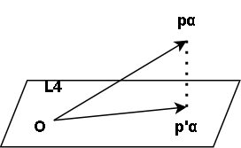
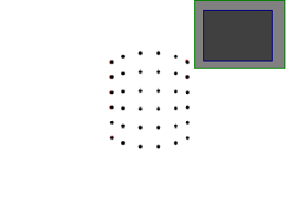
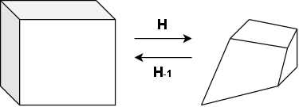
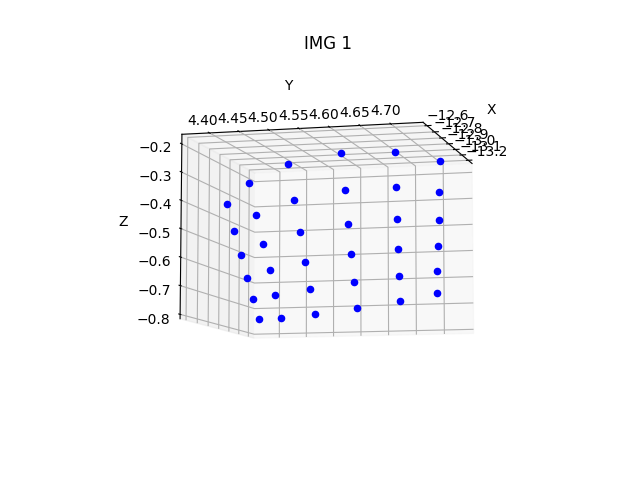

# Self-calibration of perspective camera
We describe a method for self-calibrating a perspective projection camera.
First, we show that if we give an unknown called **projective depth** to each point, we can apply the same **factorization method** as in the case of an affine camera. This projective depth is determined so that the observation matrix can be factorized. As a calculation method, we implement a **primary method** that iteratively determines the projective depth so that the column rank of the observation matrix becomes 4.

Imaging by a perspective projection camera is described by the following equation. The unknown constant $z_{\alpha k}$ is called the projective depth.

$$
z_{\alpha k}
\begin{pmatrix}
x_{\alpha k}/f_0 \\
y_{\alpha k}/f_0 \\
1 \\
\end{pmatrix}\simeq
P_kX_\alpha \tag{1}
$$

$X_\alpha$ on the right side is a four-dimensional vector in which the three-dimensional coordinates of the $\alpha$ point $X_\alpha, Y_\alpha, Z_\alpha$ and a constant $1$ are arranged, but if we introduce an unknown projective depth $z_{\alpha k}$, there is no need to consider the condition that the fourth component of vector $X_\alpha$ is $1$. This is because multiplying $X_\alpha$ by a constant is the same as multiplying $z_{\alpha k}$ by a constant.  
Therefore, the position of a point in three-dimensional space is expressed by the ratio of the components of $X$, $X_{\alpha (1)}:X_{\alpha (2)}:X_{\alpha (3)}:X_{\alpha (4)}$. This is called homogeneous coordinates. The actual three-dimensional position $(X_\alpha, Y_\alpha, Z_\alpha)$ is calculated as follows.

$$
X_\alpha=\frac{X_{\alpha (1)}}{X_{\alpha (4)}}, \quad Y_\alpha=\frac{X_{\alpha (2)}}{X_{\alpha (4)}}, \quad Z_\alpha=\frac{X_{\alpha (3)}}{X_{\alpha (4)}} \tag{2}
$$

When the fourth component $X_{\alpha (4)}$ of $X_\alpha$ is $0$, it is interpreted that $X_\alpha$ represents a point at infinity in the $(X_\alpha, Y_\alpha, Z_\alpha)$ direction.

Self-calibration of a perspective projection camera means calculating the homogeneous coordinates $X_\alpha(\alpha=1,...,N)$ of all points and the camera matrix $P_k(k=1,...,M)$ of all cameras from the observation point $(x_{\alpha k},y_{\alpha k})(\alpha=1,...,N,k=1,...,M)$.

<br></br>

# Factorization method
Arrange all observed image coordinates $(x_{\alpha k}, y_{\alpha k})$ and all projective depths $z_{\alpha k}$ in the form of the following matrix.

$$
W=
\begin{pmatrix}
z_{11}x_{11}/f_0 & z_{21}x_{21}/f_0 & ... & z_{N1}x_{N1}/f_0 \\
z_{11}y_{11}/f_0 & z_{21}y_{21}/f_0 & ... & z_{N1}y_{N1}/f_0 \\
z_{11} & z_{21} & ... & z_{N1} \\
... & ... & ... & ... \\
z_{1M}x_{1M}/f_0 & z_{2M}x_{2M}/f_0 & ... & z_{NM}x_{NM}/f_0 \\
z_{1M}y_{1M}/f_0 & z_{2M}y_{2M}/f_0 & ... & z_{NM}y_{NM}/f_0 \\
z_{1M} & z_{2M} & ... & z_{NM} \\
\end{pmatrix} \tag{3}
$$

This $3M\times N$ matrix is called the observation matrix.
Arrange the camera matrix $P_k$ of all cameras and the homogeneous coordinates $X_\alpha$ of all points in the form of the following matrix.

$$
M=
\begin{pmatrix}
P_1 \\
... \\
P_M \\
\end{pmatrix}, \quad
S=(X_1 ... X_N) \tag{4}
$$

$3M\times 4$ matrix $M$ is called the **motion matrix** and $4\times N$ matrix S is called the **shape matrix**.
The following relationship holds from Eq(1) and definitions of $S$ and $M$.

$$
W=MS \tag{5}
$$

Therefore, if the projective $z_{\alpha k}$ is known, the camera matrix $P_k$ and the homogeneous matrix $X_\alpha$ can be determined by decomposing $W$ into the product of $M$ and $S$ using singular value decomposition.
Therefore, find $z_{\alpha k}$ such that matrix $W$ in Eq(3) can be decomposed into the product of a certain $3M\times 4$ matrix $M$ and a certain $4\times N$ matrix $S$.
The condition that the matrix W can be decomposed in this way is that the rank of W is $4$.

In the primary method, $z_{\alpha k}$ is defined so that the N columns of Eq(3) span a 4-dimentional subspace, that is, it can be written as a linear combinatin of $4$ basis vectors.

Once the projective depth $z_{\alpha k}$ is determined, the camera matrix $P_k$ and the 3-dimentional position $X_\alpha$ are determined by factorizing $W$ as follows.


## 1. Singular value decomposition of W

$$
W=U_{3M\times L}\Sigma_L V_{N\times L}^\intercal, \quad
\Sigma=\begin{pmatrix}
\sigma_1 & ... & 0 \\
... & ... & ... \\
0 & ... & \sigma_L \\
\end{pmatrix} \tag{6}
$$

However, $L=min(3M,N)$, and $U_{3M\times L}$ and $V_{N\times L}$ are $3M\times L$ matrix and $N\times L$ matrix consisting of orthogonal columns.
$\Sigma_L$ is the diagonal matrix with singular values $(\sigma_1\geq ...\geq \sigma_L)$ arraned on the diagonal elements.

## 2. Let U be the $3M\times 4$ matrix consisting of the first 4 columns of $U_{3M\times L}$, and let V be the $N\times 4$ matrix consisting of the first 4 columns of $V_{N\times L}$. Then, set $\Sigma$ as follows.

$$
\Sigma=
\begin{pmatrix}
\sigma_1 & 0 & 0 & 0 \\
0 & \sigma_2 & 0 & 0 \\
0 & 0 & \sigma_3 & 0 \\
0 & 0 & 0 & \sigma_4 \\
\end{pmatrix} \tag{7}
$$

## 3. Set the motion matrix $M$ and the shape matrix $S$ as follows

$$
M=U, \quad S=\Sigma V^\intercal \tag{8}
$$

## 4. Set the camera matrix $P_k$ and the 3D position $X_\alpha$ as Eq(4)

If the projective depth $z_{\alpha k}$ is calculated collectly, the rank of the observation matrix W is 4 and the singular values in Eq(6) are $\sigma=0(i=5,...,L)$. But $z_{\alpha k}$ is not exact, this is not completely true. Therefore, set $\sigma=0(i=5,...,L)$ and approximately decompose as $W\approx MS$ by singular value decomposition.

<br></br>

# Primary method
If we set the 3-dimensional vector $x_{\alpha k}$ as follows,

$$
x_{\alpha k}=
\begin{pmatrix}
x_{\alpha k}/f_0 \\
y_{\alpha k}/f_0 \\
1 \\
\end{pmatrix} \tag{9}
$$

the observation matrix $W$ in Eq(3) can be written as follows.

$$
W=
\begin{pmatrix}
z_{11}x_{11} & ... & z_{N1}x_{N1} \\
... & ... & ... \\
z_{1M}x_{1M} & ... & z_{NM}x_{NM} \\
\end{pmatrix} \tag{10}
$$

The primary method that calculate the projective depth $z_{\alpha k}$ is as follows.

## 1. Set allowable reprojection error $\epsilon$ and initialize $z_{\alpha k}=1(\alpha=1,...,N, k=1,...,M)$

## 2. Normalize each columns of the obserbation matrix W in Eq(10) to unit vectors and singular value decompostion. then, let first 4 columns of $U_{3M\times L}$ to $u_1,...,u_4$

## 3. Perform the following calculations
### (a) Define the $M\times M$ matrix $A^{(\alpha)}=(A_{k\lambda}^{(\alpha)})$

$$
A_{k\lambda}^{(\alpha)}=\frac{\sum_{i=1}^4 (x_{\alpha k}, u_{ik})(x_{\alpha \lambda}, u_{i\lambda})}{|x_{\alpha k}||x_{\alpha \lambda}|} \tag{11}
$$

However, $u_{ik}$ is a 3D vector whose first, second, and third components are the $3(k-1)+1$, $3(k-1)+2$, $3(k-1)+3$ components of the $3M$ vector $u_i(i=1,...,4)$.

### (b) Calculate the unit vector $\xi_\alpha=(\xi_{\alpha k})$ corresponding to the max eigen value of the matrix $A^{(\alpha)}$. The sign is chosen as follows.

$$
\sum_{k=1}^M \xi_{\alpha k} \geq 0 \tag{12}
$$

### (c) Update the projective depth $z_{\alpha k}$ as follows
$$
z_{\alpha k} \leftarrow \frac{\xi_{\alpha k}}{|x_{\alpha k|}} \tag{13}
$$

## 4. Set the camera matrix $P_k$ and the 3D position $X_\alpha$ like step3,4 of the factorization method

## 5. Calculate the reprojection error as follows

$$
E=f_0\sqrt{\frac{1}{MN}\sum_{\alpha=1}^N\sum_{k=1}^M |x_{\alpha k}-Z[P_kX_\alpha]|^2} \tag{14}
$$

$Z[]$ represents the normalization let the third component to 1.

## 6. If $E < \epsilon$, finish. Otherwise, return to step2.

Let $z_{\alpha k}=1$ as a initial value equivalent to assume the affine camera.
The projective depth $z_{\alpha k}$ has a constant multiple of indeterminacy because the homogeneous matrix $X_\alpha$ also has it.
Since the space spanned by $N$ columns of $W$ is equal to the space spanned by $N$ columns of matrix $U_{3M\times L}$ of Eq(6), if $z_{\alpha k}$ is correct, each columns of $W$ are included in the 4D space $L_4$.
Set the $\alpha$ column of $W$ to $p_\alpha$, as is well known, its projection to the 4D space $L_4$ is as follows.

$$
\hat{p}_\alpha=\sum_{i=1}^4 (p_\alpha, u_i)u_i \tag{15}
$$



Because $u_1,...,u_4$ are orthonormal bases and $p_\alpha$ is normalized as $|p_\alpha|=1$, the length of perpendicular drawn from $p_\alpha$ to $L_4$.

$$
\sqrt{|p_\alpha|^2-|\hat{p}_\alpha|^2}=\sqrt{1-\sum_{i=1}^4(p_\alpha, u_i)^2} \tag{16}
$$

If $z_{\alpha k}$ is correct, this should be 0, so set $z_{\alpha k}$ to maximize the following equation.

$$
\begin{align*}
J_\alpha&=\sum_{i=1}^4(p_\alpha, u_i)^2=\sum_{i=1}^4\Bigl(\sum_{k=1}^M(z_{\alpha k}x_{\alpha k}, u_{ik})\Bigr)^2 \\
&=\sum_{k,\lambda=1}^M \Bigl( \sum_{i=1}^4(x_{\alpha k}, u_ik)(x_{\alpha \lambda}, u_i\lambda) \Bigr) z_{\alpha k}z_{\alpha \lambda} \tag{17}
\end{align*}
$$

Maximize $J_\alpha$ under the following normalization condition.

$$
|p_\alpha|^2=\sum_{k=1}^M z_{\alpha k}^2|x_{\alpha k}|^2=1 \tag{18}
$$

Define $\xi_{\alpha k}$ as follows and set $M$ dimentional vector $(\xi_{\alpha 1}, ..., \xi_{\alpha M})$ to $\xi_\alpha$, Eq(18) is simply written as $|\xi_\alpha|=1$. The matrix $A^{(\alpha)}$ is defined as Eq(11), Eq(17) can be written as follows.

$$
J_\alpha=\sum_{k,\lambda=1}^M A_{k\lambda}^{(\alpha)} \xi_{\alpha k} \xi_{\alpha \lambda}=(\xi_\alpha, A^{(\alpha)}\xi_\alpha) \tag{19}
$$

This is the quadratic form of $\xi_\alpha$, the unit vector $\xi_\alpha$ that maximize this is the unit eigen vector corresponds to the max eigen value of the matrix $A^{(\alpha)}$. The unit vector has the ambiguity of the sign, choose the sign as Eq(12).

You can try the primary method by running following command.

```bash
python3 calibrate_perspective_camera_by_primary_method.py
```

Black points are input points and red points are reprojected points using calculated the motion matrix and the shape matrix. You can see the 2 types of points almost overlap.




<br></br>
<br></br>

# Euclidean upgrading
$P_k,X_\alpha$ satisfying Eq(1) is not unique. This is because $P'_kX'_\alpha=P_kX_\alpha$ holds even if the following transformation is performed using any $4\times 4$ regular matrix $H$.

$$
P'_k=P_kH, \quad X'_\alpha=H^-X_\alpha \tag{20}
$$

It means that the recoverd shape is a projective transformation $H$ of the true shape. For example, a cube is projected to a hexahedron because length, angle and ratio are not preserved. The operation that corrects the ratio and angle is called **Euclidean upgrading**.



For Euclidean upgrading, we have to define $H$ so that $P'_k$ satisfiy some property that camera matrix should satisfiy.

First, we try remove translation $t_k$ and rotation $R_k$ from camera matrix by removing fourth column of $P_k$.

$$
P_k
\begin{pmatrix}
1 & 0 & 0 & 0 \\
0 & 1 & 0 & 0 \\
0 & 0 & 1 & 0 \\
0 & 0 & 0 & 0 \\
\end{pmatrix}
=K_k
\begin{pmatrix}
R_k^\intercal & 0
\end{pmatrix}
\tag{21}
$$

We can remove rotation $R_k$ by multiplying this matrix and its transpose.

$$
P_k
\begin{pmatrix}
1 & 0 & 0 & 0 \\
0 & 1 & 0 & 0 \\
0 & 0 & 1 & 0 \\
0 & 0 & 0 & 0 \\
\end{pmatrix}
P_k^\intercal
=K_k
K_k^\intercal
\tag{22}
$$

We find $H$ such that $P'_k=P_kH$ satisfies above equation. Considering $H$ has the indeterminacy of constant times, we get below equation.

$$
P_k\Omega P_k^\intercal \simeq K_kK_k^\intercal \tag{23}
$$

Matrix $\Omega$ is defined as follows.

$$
\Omega \equiv H
\begin{pmatrix}
1 & 0 & 0 & 0 \\
0 & 1 & 0 & 0 \\
0 & 0 & 1 & 0 \\
0 & 0 & 0 & 0 \\
\end{pmatrix}
H^\intercal \tag{24}
$$

We find $\Omega$ satisfies Eq(23) and calculate $H$ satisfies Eq(24) by using $\Omega$. We should iterate as follows because right side includes unknown $K_k$.

1. Define camera intrinsic parameter $K_k$ and calculate $\Omega$ by Eq(23).
2. Fix each $K_k$ so that Eq(23) holds true for $\Omega$.
3. Recalculate $\Omega$ for the modified $K_k$ and iterate it until Eq(24) holds for every $k$.

<br></br>

## Caculation of $\Omega$
Define camera intrinsic parameter by using focal length and approximate value of optical axis points ($u_{0k},v_{0k}$).

$$
K_k=
\begin{pmatrix}
f_k & 0 & u_{0k} \\
0 & f_k & v_{0k} \\
0 & 0 & f_0 \\
\end{pmatrix}
\tag{25}
$$

We calculate $\Omega$ satisfies Eq(23) by this $K_k$ and $P_k$.

Eq(23) can be rewritten as follows.

$$
K_k^{-1}P_k\Omega^\intercal P_k^\intercal K_k^{-1 \intercal} \simeq I \tag{26}
$$

Since $(1,1)$ element and $(1,2)$ element of left side matrix and off-diagonal elements are zero, we get 4 linear equation about $\Omega$. Calculate $\Omega$ by least square method with $4M$ equations. Specific steps are as follows.

### 1. Calculate $3\times4$ matrix $Q_k$($k=1,...,M$)

$$
Q_k=K_k^{-1}P_K \tag{27}
$$

### 2. Define $4\times4\times4\times4$ array $A=(A_{ijkl})$

$$
A_{ijkl}=\sum_{k=1}^M(Q_{k(1i)}Q_{k(1j)}Q_{k(1k)}Q_{k(1l)}
- Q_{k(1i)}Q_{k(1j)}Q_{k(2k)}Q_{k(2l)} \\
- Q_{k(2i)}Q_{k(2j)}Q_{k(1k)}Q_{k(1l)}
+ Q_{k(2i)}Q_{k(2j)}Q_{k(2k)}Q_{k(2l)} \\
+\frac{1}{4}(
Q_{k(1i)}Q_{k(2j)}Q_{k(1k)}Q_{k(2l)}
+ Q_{k(2i)}Q_{k(1j)}Q_{k(1k)}Q_{k(2l)} \\
Q_{k(1i)}Q_{k(2j)}Q_{k(2k)}Q_{k(1l)}
+ Q_{k(2i)}Q_{k(1j)}Q_{k(2k)}Q_{k(1l)}) \\
+\frac{1}{4}(
Q_{k(2i)}Q_{k(3j)}Q_{k(2k)}Q_{k(3l)}
+ Q_{k(3i)}Q_{k(2j)}Q_{k(2k)}Q_{k(3l)} \\
Q_{k(2i)}Q_{k(3j)}Q_{k(3k)}Q_{k(2l)}
+ Q_{k(3i)}Q_{k(2j)}Q_{k(3k)}Q_{k(2l)}) \\
+\frac{1}{4}(
Q_{k(3i)}Q_{k(1j)}Q_{k(3k)}Q_{k(1l)}
+ Q_{k(1i)}Q_{k(3j)}Q_{k(3k)}Q_{k(1l)} \\
Q_{k(3i)}Q_{k(1j)}Q_{k(1k)}Q_{k(3l)}
+ Q_{k(1i)}Q_{k(3j)}Q_{k(1k)}Q_{k(3l)})) \tag{28}
$$

$Q_{k(ij)}$ is $(i,j)$ element of $Q_k$.

### 3. Define $10\times 10$ matrix A

$$
A=
\begin{pmatrix}
A_{1111} & A_{1122} & A_{1133} & A_{1144} & \sqrt 2 A_{1112} & \sqrt 2 A_{1113} & \sqrt 2 A_{1114} & \sqrt 2 A_{1123} & \sqrt 2 A_{1124} & \sqrt 2 A_{1134} \\
A_{2211} & A_{2222} & A_{2233} & A_{2244} & \sqrt 2 A_{2212} & \sqrt 2 A_{2213} & \sqrt 2 A_{2214} & \sqrt 2 A_{2223} & \sqrt 2 A_{2224} & \sqrt 2 A_{2234} \\
A_{3311} & A_{3322} & A_{3333} & A_{3344} & \sqrt 2 A_{3312} & \sqrt 2 A_{3313} & \sqrt 2 A_{3314} & \sqrt 2 A_{3323} & \sqrt 2 A_{3324} & \sqrt 2 A_{3334} \\
A_{4411} & A_{4422} & A_{4433} & A_{4444} & \sqrt 2 A_{4412} & \sqrt 2 A_{4413} & \sqrt 2 A_{4414} & \sqrt 2 A_{4423} & \sqrt 2 A_{4424} & \sqrt 2 A_{4434} \\
\sqrt 2 A_{1211} & \sqrt 2 A_{1222} & \sqrt 2 A_{1233} & \sqrt 2 A_{1244} & 2 A_{1212} & 2 A_{1213} & 2 A_{1214} & 2 A_{1223} & 2 A_{1224} & 2 A_{1234} \\
\sqrt 2 A_{1311} & \sqrt 2 A_{1322} & \sqrt 2 A_{1333} & \sqrt 2 A_{1344} & 2 A_{1312} & 2 A_{1313} & 2 A_{1314} & 2 A_{1323} & 2 A_{1324} & 2 A_{1334} \\
\sqrt 2 A_{1411} & \sqrt 2 A_{1422} & \sqrt 2 A_{1433} & \sqrt 2 A_{1444} & 2 A_{1412} & 2 A_{1413} & 2 A_{1414} & 2 A_{1423} & 2 A_{1424} & 2 A_{1434} \\
\sqrt 2 A_{2311} & \sqrt 2 A_{2322} & \sqrt 2 A_{2333} & \sqrt 2 A_{2344} & 2 A_{2312} & 2 A_{2313} & 2 A_{2314} & 2 A_{2323} & 2 A_{2324} & 2 A_{2334} \\
\sqrt 2 A_{2411} & \sqrt 2 A_{2422} & \sqrt 2 A_{2433} & \sqrt 2 A_{2444} & 2 A_{2412} & 2 A_{2413} & 2 A_{2414} & 2 A_{2423} & 2 A_{2424} & 2 A_{2434} \\
\sqrt 2 A_{3411} & \sqrt 2 A_{3422} & \sqrt 2 A_{3433} & \sqrt 2 A_{3444} & 2 A_{3412} & 2 A_{3413} & 2 A_{3414} & 2 A_{3423} & 2 A_{3424} & 2 A_{3434} \\
\end{pmatrix}
\tag{29}
$$

### 4. Calculate 10-dimentional unit vector $w=(w_i)$ for minimum eigen value of matrix $A$

### 5. Define matrix $\Omega$ as follows

$$
\Omega=
\begin{pmatrix}
w_1 & w_5/\sqrt 2 & w_6/\sqrt 2 & w_7/\sqrt 2 \\
w_5/\sqrt 2 & w_2 & w_8/\sqrt 2 & w_9/\sqrt 2 \\
w_6/\sqrt 2 & w_8/\sqrt 2 & w_3 & w_{10}/\sqrt 2 \\
w_7/\sqrt 2 & w_9/\sqrt 2 & w_{10}/\sqrt 2 & w_4
\end{pmatrix} \tag{30}
$$

### 6. Calculate unit eigen vectors $w_1,...,w_4$ for eigen values $\sigma_1 \geq ... \geq \sigma_4$ of $\Omega$

### 7. Redefine $\Omega$ as follows

$$
\Omega=
\begin{cases}
\sigma_1w_1w_1^\intercal + \sigma_2w_2w_1^\intercal + \sigma_3w_3w_3^\intercal, \qquad \sigma_3 > 0 \\
-\sigma_4w_4w_4^\intercal - \sigma_3w_3w_3^\intercal - \sigma_2w_2w_2^\intercal, \qquad \sigma_2 < 0
\end{cases} \tag{31}
$$

### Explanation
Define matrix $Q_k$ as Eq(27), Eq(26) can be written as follows.

$$
Q_k\Omega Q_k^\intercal \simeq I \tag{32}
$$

The fact that $(1,1)$ element and $(2,2)$ element of left side are equal and off-diagonal elements are zero can be written as follows.

$$
\begin{align*}
\sum_{i,j=1}^4Q_{k(1i)}Q_{k(1j)}\Omega_{ij} - \sum_{i,j=1}^4Q_{k(2i)}Q_{k(2j)}\Omega_{ij} &= 0, \\
\sum_{i,j=1}^4Q_{k(1i)}Q_{k(2j)}\Omega_{ij}&=0, \\
\sum_{i,j=1}^4Q_{k(2i)}Q_{k(3j)}\Omega_{ij}&=0, \\
\sum_{i,j=1}^4Q_{k(1i)}Q_{k(1j)}\Omega_{ij}&=0
\end{align*} \tag{33}
$$

We calculate $\Omega$ minimize sum $K$ of square of these left sides over $k_1,...,M$. Define $A_{ijkl}$ as Eq(28), $K$ can be written as follows.

$$
K=\sum_{i,j,k,l=1}^4 A_{ijkl}\Omega_{ij}\Omega_{kl} \tag{34}
$$

Let $10\times10$ symetric matrix $A$ be like Eq(29) and define $10$ dimentional vector $w=(w_i)$ as Eq(30), the above equation can be rewritten in quadratic form of $w$.

$$
K=(w,Aw) \tag{35}
$$

We normalize $\Omega$ to $|\Omega|^2=\sum_{i,j=1}^4 \Omega_{ij}^2=1$ because $\Omega$ can only be determined except for constant multiplication. This means $|w|^2=1$ from Eq(30). The unit vector $w$ minimizes Eq(35) is the eigen unit vector for minimum eigen value of matrix A. Therefore, $\Omega$ can be determined by deploying the element like Eq(30). $\Omega$ must be rank 3 semipositive symmetric matrix by definition of Eq(24). Let the eigen value of $\Omega$ be $\sigma_1 \geq ... \geq \sigma_2$ and define corresponding unit vectors as $w_1,...,w_4$, $\Omega$ can be written as follows.

$$
\Omega=\sigma_1 w_1 w_1^\intercal + \sigma_2 w_2 w_2^\intercal + \sigma_3 w_3 w_3^\intercal + \sigma_4 w_4 w_4^\intercal \tag{36}
$$

From this, remove unit vector fore minimum eigen value and redefine $\Omega$ by 3 bigger unit values and their eigen vectors. At this time, the sign of $\Omega$ of Eq(30) is indeterminate because the sign of unit vector $w$ is indeterminate. Therefore, we constrain rank3 like Eq(31) by choosing sign of $\Omega$ so that eigen value becomes positive.

<br></br>

## $K$ correction
It is good that Calculated $\Omega$ satisfies Eq(23), but $K_k$ is not necessarily true, so it does not necessarily hold true. Therefore, fix $K_k$ to $K_k\delta K_k$ by multiplying $K_k$ by $\delta K_k$ close to the identity matrix. $\delta K_k$ is determined so that following equation holds true.

$$
P_k \Omega P_k \simeq (K_k\delta K_k)(K_k\delta K_k)^\intercal \tag{37}
$$

This equation can be written as follows.

$$
K_k^{-1} P_k \Omega P_k K_k^{\intercal-1} \simeq \delta K_k \delta K_k \tag{38}
$$

We define $\delta K_k$ so that $Q_k\Omega Q_k^\intercal$ is a constant times $\delta K_k \delta K_k$. Specific steps are as follows.

### 1. Define element of $Q\Omega Q^\intercal$ as follows

$$
Q\Omega Q^\intercal=
\begin{pmatrix}
c_{k(11)} & c_{k(12)} & c_{k(13)} \\
c_{k(21)} & c_{k(22)} & c_{k(23)} \\
c_{k(31)} & c_{k(32)} & c_{k(33)} \tag{39}
\end{pmatrix}
$$

### 2. Calculate $F_k$

$$
F_k=\frac{c_{k(11)} + c_{k(22)}}{c_{k(33)}} - \Bigl(\frac{c_{k(13)}}{c_{k(33)}}\Bigr)^2 - \Bigl(\frac{c_{k(23)}}{c_{k(33)}}\Bigr)^2 \tag{40}
$$

### 3. If $c_{k(33)} \leq 0$ or $F_k \leq 0$, finish without fixing $K_k$

### 4. Otherwise, calculate amounts of correction of optical axis point $(u_{0k}, v_{0k})$ and focal length $f_k$

$$
\begin{align*}
\delta u_{0k} &= \frac{c_{k(13)}}{c_{k(33)}}, \quad \delta v_{0k} = \frac{c_{k(23)}}{c_{k(33)}} \\
\delta f_k &= \sqrt{\frac{1}{2} \Bigl( \frac{c_{k(11)} + c_{k(22)}}{c_{k(33)}} - \delta u_{0k}^2 - \delta u_{0k}^2 \Bigr)} \tag{41}
\end{align*}
$$

### 5. Calculate $\delta K_k$

$$
\delta K_k =
\begin{pmatrix}
\delta f_k & 0 & \delta u_{0k} \\
0 & \delta f_k & \delta v_{0k} \\
0 & 0 & 1 \tag{42}
\end{pmatrix}
$$

### 6. Fix $K_k$

$$
K_k \leftarrow K_k \delta K_k, \quad K_k \leftarrow \sqrt{c_{k(33)}} K_k \tag{43}
$$

### Explanation
We define amount of correction of $K_k$ by difinition of camera parameter. $\delta u_{0k}, \delta v_{0k}$ are close to $0$ and $\delta f_k$ is a correction ratio close to $1$. $\delta K_k \delta K_k^\intercal$ is as follows.

$$
\delta K_k \delta K_k^\intercal=
\begin{pmatrix}
\delta f_k^2+\delta u_{0k}^2 & \delta u_{0k}\delta v_{0k} & \delta u_{0k} \\
\delta u_{0k}\delta v_{0k} & \delta f_k^2+\delta v_{0k}^2 & \delta v_{0k} \\
\delta u_{0k} & \delta v_{0k} & 1 \tag{44}
\end{pmatrix}
$$

Define $\delta u_{0k},\delta v_{0k}$ as Eq(41) so that above value is a constant times Eq(39). $\delta f_k$ is the average of $(1,1)$ element and $(2,2)$ element. If $(3,3)$ element of Eq(39) is not positive or the radical in Eq(41) is not positive, we don't fix $K$. Eq(39) has indeterminancy of constant times and only raio between elements is meaningful. It is undesiable for calculation purposes that elements are too large or too small. Therefore, devide $Q_k$ by $\sqrt{c_{k(33)}}$ so that Eq(39) is close to identity matrix. This corresponds to multiply $K_k$ by $\sqrt{c_{k(33)}}$ from Eq(27). This is done with Eq(43).

<br></br>

## Calculation of $H$
Think about defining $4\times 4$ homography matrix $H$ satisfies Eq(24). Eq(24) can be written as follows by defining column of $H$ as $h1,...,h4$.

$$
\Omega=h_1h_1^\intercal + h_2h_2^\intercal + h_3h_3^\intercal \tag{45}
$$

Therefore, we can't define the $4$ column $h_4$ because we remove the translation $t_k$. This corresponds to that absolute location of world coordinate can't be determined. Therefore, we can set $h_4$ arbitrarily so that $H$ becomes regular matrix. The simple way is to choose $\Omega$ so that $\sigma_1, \sigma_2, \sigma_3$ become positive and turn $\sqrt{\sigma_1}w_1, \sqrt{\sigma_2}w_2, \sqrt{\sigma_3}w_3, w_4$ into $h_1, h_2, h_3, h_4$.

$$
H=
\begin{cases}
(\sqrt{\sigma_1}w_1, \sqrt{\sigma_2}w_2, \sqrt{\sigma_3}w_3, w_4), \quad \sigma_3 > 0 \\
(\sqrt{-\sigma_4}w_4, \sqrt{-\sigma_3}w_3, \sqrt{-\sigma_2}w_2, w_1), \quad \sigma_2 < 0 \tag{46}
\end{cases}
$$

<br></br>

## Euclidean upgrading
The method of Euclidean upgrading is as follows.

### 1. Let $\hat{J}_{med}$ be $\hat{J}_{med}=\infty$ and set initial value of intrinsic parameter matrix $K_k$

### 2. Calculate $\Omega$

### 3. Caclulate $H$

### 4. Fix each $K_k$

### 5. If $K_k$ is fixed, set $J_k$ as follows. When K isn't fixed, let $J_k=\infty$.

$$
J_k = \Bigl( \frac{c_{k(11)}}{c_{k(33)}} - 1 \Bigr)^2 + \Bigl( \frac{c_{k(22)}}{c_{k(33)}} - 1 \Bigr)^2 + 2\frac{c_{k(12)}^2 + c_{k(23)}^2 + c_{k(31)}^2}{c_{k(33)}^2} \tag{47}
$$

### 6. Calculate following median

$$
J_{med}=med_{k=1}^M J_k \tag{48}
$$

### 7. If $J_{med} \approx 0$ or $J_{med} \geq \hat{J}_{med}$, return $H,K_k$ and finish

### 8. Otherwise, let $\hat{J}_{med} \leftarrow J_{med}$ and return step2

### Explanation
<<<<<<< HEAD
$J_k$ of Eq(47) measures how close Eq(39) is to constant times the identity matrix. Ideally, we should iterate for every $k$ until $F_k\approx 0$, it often doesn't get that far in reality. There are several possible reasons for this. First, positions of each images are not necessarily correct because of some errors in real data. Also, camera matrix $P_k$ are not necessarily calculated correctly by using primary method. That's why, we evaluate median in step6 to exclude images with large error.
=======
$J_k$ of Eq(47) measures how close Eq(39) is to constant times the identity matrix. Ideally, we should iterate for every $k$ until $F_k\approx 0$, it often doesn't get that far in reality. There are several possible reasons for this. First, positions of each images are not necessarily correct because of some errors in real data. Also, camera matrix $P_k$ are not necessarily calculated correctly by using primary method. That's why, we evaluate median in step6 to exclude images with large error. 
>>>>>>> 333071230be03124b5c6b5ee0da8ebf71bb2e254

<br></br>

## 3D reconstruction calculation
If you get projective transformation matrix $H$ and intrinsic paramter matrix $K_k$, you can calculate each 3D positions $X_\alpha, Y_\alpha, Z_\alpha$ and $t_k, R_k$ by converting $X_\alpha$ and camera matrix $P_k$ as follows.

### 1. Projective transform each $X_\alpha$ as follows

$$
X_\alpha \leftarrow H^{-1}X_\alpha \tag{49}
$$

### 2. Define elements of $X_\alpha$ as follows and calculate 3D position $(X_\alpha, Y_\alpha, Z_\alpha)$ by Eq(2)

### 3. Projective transform each $P_k$ as follows

$$
P_k \leftarrow P_k H \tag{50}
$$

### 4. Calculate matrix $A_k$ and vector $b_k$

$$
K_k^{-1}P_k=
\begin{pmatrix}
A_k & b_k \tag{51}
\end{pmatrix}
$$

### 5. Define scale constant $s$ as follows and normalize $A_k$ and $b_k$

$$
A_k \leftarrow \frac{A_k}{s}, \quad b_k \leftarrow \frac{b_k}{s} \tag{52}
$$

### 6. Perform singular value decomposition of $A_k$ as follows

$$
A_k=U_A\Sigma_A V_A^\intercal \tag{53}
$$

### 7. Calculate rotation $R_k$ as follows

$$
R_k=V_A U_A^\intercal \tag{54}
$$

### 8. Calculate translation $t_k$ as follows

$$
t_k=-R_k b \tag{55}
$$

### 9. Calculate the position of the point seen from the coordinate system from the $k$-th camera as follows

$$
\begin{pmatrix}
X_{\alpha k} \\
Y_{\alpha k} \\
Z_{\alpha k} \\
\end{pmatrix}=
R_k^\intercal
\begin{pmatrix}
\begin{pmatrix}
X_{\alpha} \\
Y_{\alpha} \\
Z_{\alpha} \\
\end{pmatrix}-t_k
\end{pmatrix} \tag{56}
$$

### 10. If the formula below doesn't hold, we change signs of $t_k$ and $(X_\alpha, Y_\alpha, Z_\alpha)$. $sgn(x)$ is sign function that return $1, 0, -1$ according to $x>0,x=0,x<0$.

### Explanation
$H^{-1}X_\alpha$ and $P_kH^{-1}$ are correct values for projective restored homogenious coordinates $X_\alpha$ and camera matrix $P_k$ by definition of projective transformation matrix $H$. Correct camera matrix $P_k$ is as follows.

$$
P_k=K_k
\begin{pmatrix}
R_k^\intercal & -R_k^\intercal t_k
\end{pmatrix} \tag{57}
$$

In projective restoration, camera matrix $P_k$ can only be calculated except for constant multiplication. From this, If projective restoration and projective transformation $H$ of Euclidean upgrading are calculated correctly, the right side of Eq(51) is constant multiplication of $\begin{pmatrix}R_k^\intercal & -R_k^\intercal t_k\end{pmatrix}$. Therefore, if we normalize $A_k$ as $det A_k=1$, $A_k$ equals $R_k^\intercal$. However, projective restoration and Euclidean upgrading are not necessarily calculated correctly, $A_k$ is not necessarily rotation matrix. Therefore, when $A_k$ is singular value decomposed, if $A_k$ is rotation matrix, $\Sigma_A$ is identity matrix $I$, but this is not necessarily the case. So we replace $\Sigma_A$ with identity matrix $I$ and let it be $R_k^\intercal$.  
The probelem of mirror image resolution occurs like 3D reconstruction by two images. Projective restoration has uncertainly of sign, so it is possible that above result of calculation is mirror image resolution. To determine this, calculate point $(X_\alpha, Y_\alpha, Z_\alpha)$ seen from the k-th camera coordinates as Eq(56). And determine whether it is mirror image resolution by step 10.

You can try the Euclidean upgrading by running following command.

```bash
python3 calibrate_perspective_camera_by_primary_method.py Show3DPoints
```

Reconstructed 3D points are as follows.



<br></br>

# Reference
- [3D Computer Vision Computation Handbook](https://www.morikita.co.jp/books/mid/081791)
