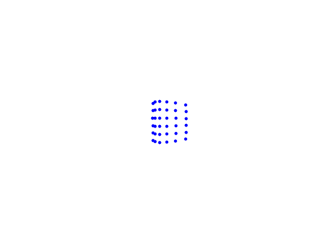
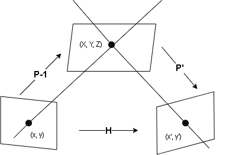

# Triangulation
If two cameras are used to capture the same scene, the 3D positions of corresponding points can be recovered if the position, orientation, and internal parameters of each camera are known. This is because the line of sight at that point, starting from the lens center of each camera, can be determined, and the triangle connecting the lens centers of the two cameras and that point in the scene can be calculated. This is called triangulation.

<br></br>

# Perspective projection
The XYZ coordinates are fixed in the scene and are called the world coordinate system. On the other hand, apart from that, consider an XcYcZc coordinate system fixed to the camera with the center of the camera lens as Oc and the optical axis as Zc axis. This is called the camera coordinate system. Also, consider a plane with an xy coordinate system fixed to the camera. This is identified with the image and is called the image plane.
Then, a point (X, Y, Z) in the scene is assumed to be captured at the intersection (x, y) of the image plane and a line passing through the point and the lens center Oc. Such a model is called a perspective projection. The lens center Oc is called the viewpoint, the line passing through it and the point (x, y) is called the line of sight, and the intersection point (u0, v0) between the image plane and the optical axis is called the principal point.
Let t be a vector representing the position of viewpoint Oc in the world coordinate system and R be a rotation matrix of the XcYcZc camera coordinate system relative to the XYZ world coordinate system, then the camera position and orientation can be specified by {t,R}. These are called the motion parameters of the camera, and t and R are called the translation and rotation of this camera, respectively.

<br></br>

# Camera Matrix and Triangulation
The point (X,Y,Z) in the scene that is projected onto the image (x,y) is represented by the following fractional expression from the model of perspective projection.

$$
\begin{align*}
x=f_0\frac{P_{11}X+P_{12}Y+P_{13}Z+P_{14}}{P_{31}X+P_{32}Y+P_{33}Z+P_{34}}, y=f_0\frac{P_{21}X+P_{22}Y+P_{23}Z+P_{24}}{P_{31}X+P_{32}Y+P_{33}Z+P_{34}} \tag{1}
\end{align*}
$$

$f_0$ is a scale constant and $Pij(i=1,2,3,j=1,.... ,4)$ are coefficients determined from the camera's internal constants and motion parameters. Eq(1) can be rewritten as

$$
\begin{align*}
\begin{pmatrix}
x/f_0 \\
y/f_0 \\
1 \\
\end{pmatrix}\simeq
\begin{pmatrix}
P_{11} & P_{12} & P_{13} & P_{14} \\
P_{21} & P_{22} & P_{23} & P_{24} \\
P_{31} & P_{32} & P_{33} & P_{34} \\
\end{pmatrix}
\begin{pmatrix}
X \\
Y \\
Z \\
1 \\
\end{pmatrix} \tag{2}
\end{align*}
$$

The matrix $P=(P_{ij})$ is called the camera matrix. To perform triangulation, the camera matrix $P$ must be calculated in advance. This is called camera calibration.
Let $P=(P_{ij})$ and $P\prime=(P\prime_{ij})$ for the two camera matrices, respectively. When a point (X,Y,Z) in the scene is observed at a point (x,y),(x',y') on each image, if there is no error in the observation, (X,Y,Z) can be calculated from (x,y),(x',y') as follows.

## Triangulation by Camera Matrix

### **1. Calculate the following 4x3 matrix T and 4-dimensional vector p**

$$
\begin{align*}
T=\begin{pmatrix}
f_0P_{11}-xP_{31} & f_0P_{12}-xP_{32} & f_0P_{13}-xP_{33} \\
f_0P_{21}-yP_{31} & f_0P_{22}-yP_{32} & f_0P_{23}-yP_{33} \\
f_0P\prime_{11}-x\prime P\prime_{31} & f_0P\prime_{12}-x\prime P\prime_{32} & f_0P\prime_{13}-x\prime P\prime_{33} \\
f_0P\prime_{21}-y\prime P\prime_{31} & f_0P\prime_{22}-y\prime P\prime_{32} & f_0P\prime_{23}-y\prime P\prime_{33} \\
\end{pmatrix},
p=\begin{pmatrix}
f_0P_{14}-xP_{34} \\
f_0P_{24}-yP_{34} \\
f_0P\prime_{14}-x\prime P\prime_{34} \\
f_0P\prime_{24}-y\prime P\prime_{34} \\
\end{pmatrix} \tag{3}
\end{align*}
$$

### **2. Solve the following simultaneous linear equations to obtain X, Y, and Z**

$$
T^\intercal T\begin{pmatrix}
X \\
Y \\
Z \\
\end{pmatrix}=-T^\intercal p \tag{4}
$$

By rearranging the denominator in Eq(1) and doing the same for the second camera, the following simultaneous linear equations are obtained for X, Y, and Z.

$$
\begin{align*}
(f_0P_{11}-xP_{31})X + (f_0P_{12}-xP_{32})Y + (f_0P_{13}-xP_{33})Z + f_0P_{14} - xP_{34} = 0 \\
(f_0P_{21}-yP_{31})X + (f_0P_{22}-yP_{32})Y + (f_0P_{23}-yP_{33})Z + f_0P_{24} - yP_{34} = 0 \\
(f_0P\prime_{11}-x\prime P\prime_{31})X + (f_0P\prime_{12}-x\prime P\prime_{32})Y + (f_0P\prime_{13}-x\prime P\prime_{33})Z + f_0P\prime_{14} - x\prime_P\prime_{34} = 0 \\
(f_0P\prime_{21}-y\prime P\prime_{31})X + (f_0P\prime_{22}-y\prime P\prime_{32})Y + (f_0P\prime_{23}-y\prime P\prime_{33})Z + f_0P\prime_{24} - y\prime P\prime_{34} = 0 \tag{5}
\end{align*}
$$

This is four equations for three unknowns X, Y, and Z, which are linearly dependent on each other, with three independent ones. Therefore, if any three of these four are extracted and the solution is calculated, the remaining equations are automatically satisfied. However, the same solution can be obtained by solving these simultaneously. Specifically, using the matrix T and vector p in Eq(3), write Eq(5) as follows,

$$
T\begin{pmatrix}
X \\
Y \\
Z \\
\end{pmatrix}=p \tag{6}
$$

we can solve Eq(4) by multiplying both sides by $T^\intercal$.
This is nothing more than applying the least-squares method to Eq(6).

$$
\begin{align*}
\lVert Ax-b \rVert^2&=(Ax-b,Ax-b) \\
&=(Ax,Ax)-2(Ax-b)+(b,b) \\
&=(x,A^\intercal Ax)-2(x,A^\intercal b)+\lVert b \rVert^2
\end{align*}
$$

Differentiating by x, we obtain the following equation.

$$
A^\intercal Ax=A^\intercal b
$$

## Triangulation from corresponding points with errors
If there is an error in the observation points (x,y), (x',y'), the lines of sight defined by the two cameras do not necessarily intersect at a single point. For this case, there is a method to compensate.  
A reasonable method is to compute the 3D position (X,Y,Z) by shortest correction on the image to the position where the observed corresponding points (x,y), (x',y') intersect the line of sight. The necessary and sufficient condition for the line of sight to intersect is the epipolar equation, and the basis matrix $F$ is obtained from the camera matrices $P$, $P\prime$.

$$
\begin{pmatrix}
\begin{pmatrix}
x/f_0 \\
y/f_0 \\
1 \\
\end{pmatrix},
F\begin{pmatrix}
x\prime/f_0 \\
y\prime/f_0 \\
1 \\
\end{pmatrix}
\end{pmatrix}=0 \tag{7}
$$

Consider the shortest possible correction of the observed corresponding point $(x,y), (x\prime,y\prime)$ to the position $(\bar{x},\bar{y}), (\bar{x}\prime,\bar{y}\prime)$ that satisfies equation (7). Minimize the sum of squares of the following travel distances.

$$
S=(x-\bar{x})^2+(y-\bar{y})^2+(x\prime-\bar{x}\prime)^2+(y\prime-\bar{y}\prime)^2 \tag{8}
$$

This $S$ is called the reprojection error.  

You can try the triangulation by running below command.

```bash
python triangulation.py
```

The following two viewpoint camera images were used for the test data.

 

<br></br>

# Planar triangulation
Triangulation that recovers the 3D position of a known plane from the corresponding points between two images taken of the plane and the camera matrix of each camera is called planar triangulation. This is the triangulation we have been discussing, with the added constraint that the restoration location be on a specified plane.

## Perspective projection of a plane
Consider taking a picture of a flat surface with two cameras. Let the respective camera matrices be $P$ and $P\prime$, and let a point $(X,Y,Z)$ on the plane be captured at a point $(x,y)$,$(x\prime,y\prime)$ on the respective images, the following relation follows from Eq(2) in triangulation.

$$
\begin{pmatrix}
x/f_0 \\
y/f_0 \\
1 \\
\end{pmatrix}\simeq
P
\begin{pmatrix}
X \\
Y \\
Z \\
1 \\
\end{pmatrix}, \quad
\begin{pmatrix}
x\prime/f_0 \\
y\prime/f_0 \\
1 \\
\end{pmatrix}\simeq
P\prime
\begin{pmatrix}
X \\
Y \\
Z \\
1 \\
\end{pmatrix} \tag{1}
$$

The equation of the plane $Z=aX+bY+c$. The plane parallel to the $Z$-axis cannot be represented, in which case $X=aY+bZ+c$, or $Y=aX+bZ+c$.
This allows us to write

$$
\begin{pmatrix}
X \\
Y \\
Z \\
1 \\
\end{pmatrix}=
C
\begin{pmatrix}
X \\
Y \\
1 \\
\end{pmatrix}, \quad
C\equiv
\begin{pmatrix}
1 & 0 & 0 \\
0 & 1 & 0 \\
a & b & c \\
0 & 0 & 1 \\
\end{pmatrix} \tag{2}
$$

Eq(1) becomes

$$
\begin{pmatrix}
x/f_0 \\
y/f_0 \\
1 \\
\end{pmatrix}\simeq
\bar{P}
\begin{pmatrix}
X \\
Y \\
1 \\
\end{pmatrix}, \quad
\begin{pmatrix}
x\prime/f_0 \\
y\prime/f_0 \\
1 \\
\end{pmatrix}\simeq
\bar{P\prime}
\begin{pmatrix}
X \\
Y \\
1 \\
\end{pmatrix} \quad
\bar{P}\equiv PC, \quad
\bar{P\prime}\equiv P\prime C, \tag{3}
$$

Since a point on the plane and its shooting position on the image are one-to-one, the matrices $P$ and $P\prime$ are both regular matrices. This means that the perspective transformation from a plane to an image and vice versa is a projective transformation.

$$
\begin{pmatrix}
x\prime/f_0 \\
y\prime/f_0 \\
1 \\
\end{pmatrix}\simeq
H
\begin{pmatrix}
x/f_0 \\
y/f_0 \\
1 \\
\end{pmatrix}, \quad
H \equiv
\bar{P\prime}\bar{P}^{-1} \tag{4}
$$



## Planar triangulation
The projective transformation matrix $H$ is assumed to be known. Once the corresponding points $(x, y), (x\prime, y\prime)$ are observed, if the camera matrices $P$ and $P\prime$ are known, the 3D position can be recovered by triangulation. However, if there is an error in the corresponding point $(x, y), (x\prime, y\prime)$, the restored point $(X, Y, Z)$ may not be on the specified plane. The restoration on the specified plane is called planar triangulation.

When the plane is known, it is reasonable to correct $(x, y),(x\prime, y\prime)$ to the shortest $(\bar{x},\bar{y}),(\bar{x\prime},\bar{y\prime})$ so that their lines of sight intersect and their intersection points are on that plane. Mathematically, this is to minimize the reprojection error for the correction under the constraint that $(x,y),(x\prime,y\prime)$ satisfies the projective transformation in Eq.(4).

$$
S=(x-\bar{x})^2+(y-\bar{y})^2+(x\prime-\bar{x\prime})^2+(y\prime-\bar{y\prime})^2 \tag{5}
$$

### Algorithm
Denote $H$ by the 9-dimensional vector $\theta$, as in the [projective transformation](https://github.com/Hiroaki-K4/3d_computer_vision/tree/main/projective_transformation).

#### **1. Let $S$ be a sufficiently large number and $\hat{x}=x,\hat{y}=y,\hat{x}\prime=x\prime,\hat{y}\prime=y\prime$. Then define the following 4-dimensional vector**

$$
p=\begin{pmatrix}
x \\
y \\
x\prime \\
y\prime \\
\end{pmatrix}, \quad
\hat{p}=\begin{pmatrix}
\hat{x} \\
\hat{y} \\
\hat{x}\prime \\
\hat{y}\prime \\
\end{pmatrix}, \quad
\tilde{p}=\begin{pmatrix}
\tilde{x} \\
\tilde{y} \\
\tilde{x}\prime \\
\tilde{y}\prime \\
\end{pmatrix} \tag{6}
$$

#### **2. Define matrix $T^{(k)}$**

$$
T^{(1)}=\begin{pmatrix}
0 & 0 & 0 & 0 \\
0 & 0 & 0 & 0 \\
0 & 0 & 0 & 0 \\
-f_0 & 0 & 0 & 0 \\
0 & -f_0 & 0 & 0 \\
0 & 0 & 0 & 0 \\
\hat{y}\prime & 0 & 0 & \hat{x} \\
0 & \hat{y}\prime & 0 & \hat{y} \\
0 & 0 & 0 & f_0 \\
\end{pmatrix},
T^{(2)}=\begin{pmatrix}
f_0 & 0 & 0 & 0 \\
0 & f_0 & 0 & 0 \\
0 & 0 & 0 & 0 \\
0 & 0 & 0 & 0 \\
0 & 0 & 0 & 0 \\
0 & 0 & 0 & 0 \\
-\hat{x\prime} & 0 & -\hat{x} & 0 \\
0 & -\hat{x\prime} & -\hat{y} & 0 \\
0 & 0 & -f_0 & 0 \\
\end{pmatrix},
T^{(3)}=\begin{pmatrix}
-\hat{y\prime} & 0 & 0 & -\hat{x} \\
0 & -\hat{y\prime} & 0 & -\hat{y} \\
0 & 0 & 0 & -f_0 \\
\hat{x\prime} & 0 & \hat{x} & 0 \\
0 & \hat{x\prime} & \hat{y} & 0 \\
0 & 0 & f_0 & 0 \\
0 & 0 & 0 & 0 \\
0 & 0 & 0 & 0 \\
0 & 0 & 0 & 0 \\
\end{pmatrix} \tag{7}
$$

#### **3. Calculate $V_0^{(kl)}[\hat{\xi}]$ and $\hat{W}^{(kl)}$. ($k,l=1,2,3$)**

$$
V_0^{(kl)}[\hat{\xi}]=\hat{T}^{(k)}\hat{T}^{(l)\intercal}, \quad \hat{W}^{(kl)}=((\theta, V_0^{(kl)}[\hat{\xi}]\theta))_2^- \tag{8}
$$

#### **4. Calculate $\xi^{(1)},\xi^{(2)},\xi^{(3)}$**

$$
\xi^{(1)}=
\begin{pmatrix}
0 \\
0 \\
0 \\
-f_0\hat{x} \\
-f_0y \\
-f_0^2 \\
\hat{x}\hat{y}\prime \\
\hat{y}\hat{y}\prime \\
f_0\hat{y}\prime \\
\end{pmatrix}+\hat{T}^{(1)}\tilde{p}, \quad
\xi^{(2)}=
\begin{pmatrix}
f_0\hat{x} \\
f_0\hat{y} \\
f_0^2 \\
0 \\
0 \\
0 \\
-\hat{x}\hat{x}\prime \\
-\hat{y}\hat{x}\prime \\
-f_0\hat{x}\prime \\
\end{pmatrix}+\hat{T}^{(2)}\tilde{p}, \quad
\xi^{(3)}=
\begin{pmatrix}
-\hat{x}\hat{y}\prime \\
-\hat{y}\hat{y}\prime \\
-f_0\hat{y}\prime \\
\hat{x}\hat{x}\prime \\
\hat{y}\hat{x}\prime \\
f_0\hat{x}\prime \\
0 \\
0 \\
0 \\
\end{pmatrix}+\hat{T}^{(3)}\tilde{p} \tag{9}
$$

#### **5. Update $\tilde p, \hat{p}$**

$$
\tilde p \leftarrow \sum_{k,l=1}^3 \hat{W}^{(kl)}(\xi^{(k)}, \theta)\hat{T}^{(l)\intercal}\theta, \quad \hat{p} \leftarrow p-\tilde{p} \tag{10}
$$

#### **6. If $\| \tilde{p}\|^2\approx S$, return $(\hat{x},\hat{y}),(\hat{x}\prime,\hat{y}\prime)$**. If not, update $S(S \leftarrow \| \tilde{p}\|^2)$ and go back to step2.

<br></br>

To learn more about the formula, click [here](https://www.jstage.jst.go.jp/article/ipsjtcva/3/0/3_0_67/_pdf/-char/en).

You can try planar triangulation by running below command.

```bash
python3 planar_triangulation.py
```

<br></br>

# Reference
- [3D Computer Vision Computation Handbook](https://www.morikita.co.jp/books/mid/081791)
- [Optimal Two-View Planar Scene Triangulation](https://www.jstage.jst.go.jp/article/ipsjtcva/3/0/3_0_67/_pdf/-char/en)
